# 2022.10.18

## 모델링

### 1정규화

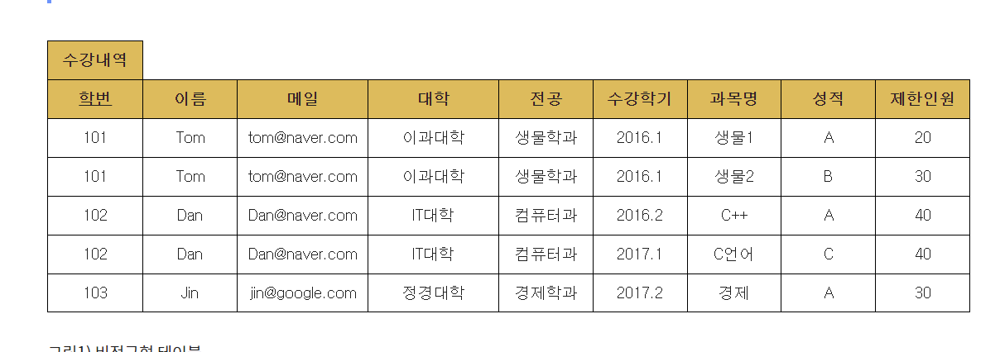
제 1정규형을 갖추려면 도메인 원자값 이라는 조건이 만족해야 합니다.

도메인 원자값을 만족시킨다는 것은 아래와 조건과 같습니다.

1. 반복 그룹이 존재하면 안된다.

- Tom이라는 학생에 대한 정보인 이름,메일,대학,전공은 초기 설정하면 이후 계속 따라오게 됩니다.

그렇기 때문에 해당 정보는 수강 내역을 확인하기 위해서 계속 반복되기에 테이블을 분리합니다.

2. 모든 행은 식별자로 완전하게 구분되어야 한다.

그렇다면 이 비정규형 테이블 예제를 1정규화 시켜 보도록 정리해 보도록 하겠습니다.

1. 반복되는 부분을 체크합니다. -> 학번, 이름, 메일 ,대학, 전공 (Prime key : 학번)

2. 반복되는 부분과 그렇지 않은 부분을 분리합니다. (단, prime key는 그대로 가져갑니다.)

3. 테이블을 나눈 후 반복되는 행은 삭제합니다.

이 과정을 거치면 아래와 같은 테이블로 변경이 됩니다.

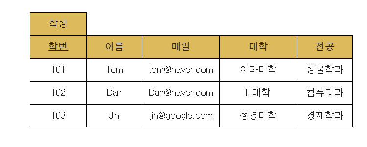
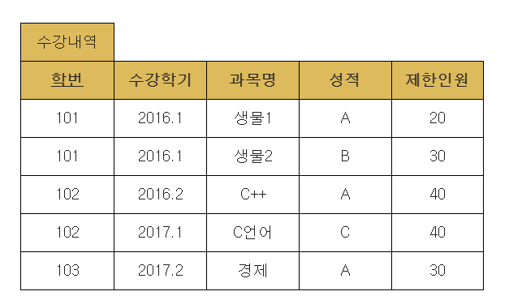

그런데, '학생' 테이블은 2번 조건인 "모든 행은 식별자로 완전하게 구분되어야 한다." 라는 조건이 만족하는 반면

수강내역은 prime key인 '학번'만으로는 모든 행이 구분되지 않습니다.

그렇기 때문에 추가적으로 key를 설정 해 주어야 합니다.

그래서 '수강 내역' 테이블의 '학번'+'수강학기'+'과목명'을 복합하여 식별자로 두면서 문제를 해결하면 제 1 정규화는 마무리 됩니다.
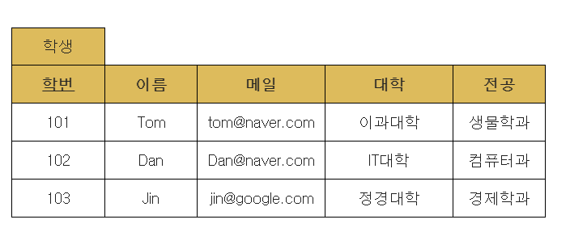
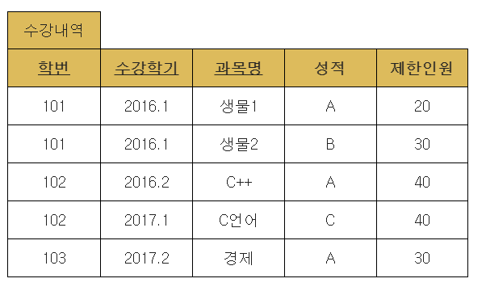

- 제 2 정규화 - 부분함수 종속 제거

필요 충분 조건 : 후보키 K와 K에 속하지 않는 속성 A가 있을 때, A를 결정하기 위해 K의 일부가 아닌 K 전체를 참조해야만 하는 경우 1NF 테이블은 2NF이다.

뭔 소리야?

간단하게 말하면 Key가 아닌 값들은 모두 key에 종속 되어야한다는 말입니다.
이래도 말이 어렵기 때문에 그림으로 이해해보도록 하져

조건은 다음과 같습니다.

1. key가 아닌 컬럼(속성)은 key 컬럼이에 종속 되어야 한다.
2. key가 아닌 컬럼(속성)은 key 컬럼에만! 종속 되어야 한다. 그래서
3. 복합키 일때만! 제 2정규형의 조건이 되는것이지요. (복합키가 아니면 제 2정규형을 넘어 제 3정규형을 보면 됩니다)
   TiP) 결과적으로 Key 값에 주목하는것이 제2 정규화의 핵심!

제 1정규형을 마친 '수강내역' 테이블을 보겠습니다.

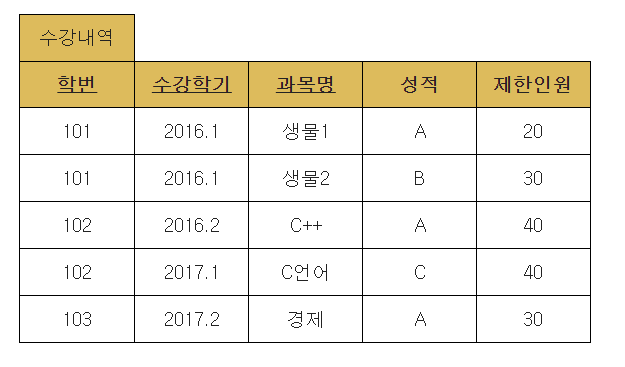
'수강내역' 테이블은 '학번+수강학기+ 과목명'(이하 학+수+과)으로 이루어진 복합키 입니다.
그러면 제2 정규형에 만족을 하려면 복합키인 학+수+과에 성적과 제한 인원이 확실하게 종속 돼야 한다는 것인데
살펴봅시다.

'성적'의 경우는 학번과 수강학기 과목명을 알아야 해당 학기 성적을 알 수 있기때문에 key에 종속이 되는것을 확인했는데,
'제한인원'의 경우는 학번과는 딱히 관계가 없어 보입니다.

그렇기 때문에 이것을 한번 더 나눌 수 있다는 것! 이겠지요
그러면 분리 해봅시다.

Key '수강학기+ 과목명' non-key '제한인원'으로 구성된 테이블 '개설 과목'으로 분리가 됩니다.

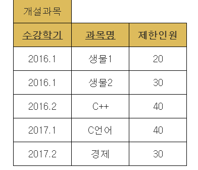
그래서 제 2정규화를 하게 되면 수강내역 테이블은 수강내역 + 개설과목 2개 테이블로 나누어 집니다.

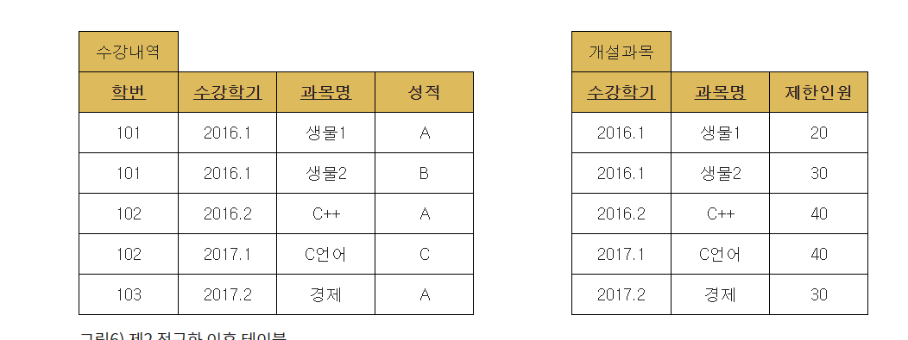
이렇게 제2 정규형 테이블이 되었습니다.
컬럼이 많을경우 경우의수를 다 따져가며 확인해야하는 불편함이 있겠네여
학번/수강학기/과목명/ 학번+수강학기/수강학기+과목명/학번+과목명/.... ㅠㅠ
복합키가 많아지면 귀찮아질듯 ㅎ

- 제 3정규화 - 이행적 함수 종속 제거

필요 충분 조건 : 제 2정규형을 만족하고, 테이블 내의 모든 속성이 키에만 의존하며 다른 후보키에 의존하지 않는다.

정리하면

1. 모든 key가 아닌 컬럼(non-key)은 key 컬럼(속성)에 완전히 종속 되어야 한다.
2. 모든 non-key 컬럼은 key 컬럼(속성)에만 종속 되어야 한다.
3. 그래서 key가 아닌 값에 주목!

제 2정규형 조건을 만족하는 '학생' 테이블을 확인해보져
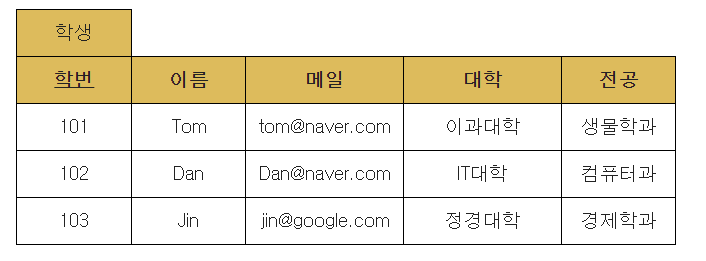
위에서 보게되면 non key 컬럼인 '대학'과 '전공'을 보게되면 key가 아닌 컬럼인데도 불구하고

종속 관계가 성립이 됩니다.

'대학'의 경우 '전공'을 포함하기 때문입니다.

즉, 생물학과면 무조건 이과대학에 포함되고, 컴퓨터 학과의 경우 IT대학의 부분으로 포함이 되지요.

정규화가 잘 된 테이블은 갑-을 관계만 있는 것 입니다.

그런데 '학생'테이블의 경우 갑(key:학번)-을(non-key:대학)-병(non-key : 전공) 관계가 있기 때문에 이 관계를 깔끔하게 정리 해주어야 합니다.

학번/이름/메일/전공 - 대학/전공으로 테이블이 나뉘게 됩니다.

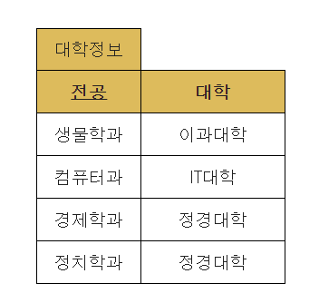
'대학정보' 테이블의 경우 대학이 전공을 포함합니다. 하지만 key는 테이블의 튜플을 구분해 낼 수 있어야 합니다.

그래서튜플을 구분하기 위해서는 '전공'이 key 값이 되겠지요.

'대학' 정보를 참조하기 위해서는 학생 테이블의 '전공'을 외래키(foreign key)로 설정하여 '대학정보' 테이블을 참조 할 수 있게 해야 합니다.

그래서 제 3정규화를 마친 '학생' 테이블은 다음과 같이 분리 하게 됩니다.

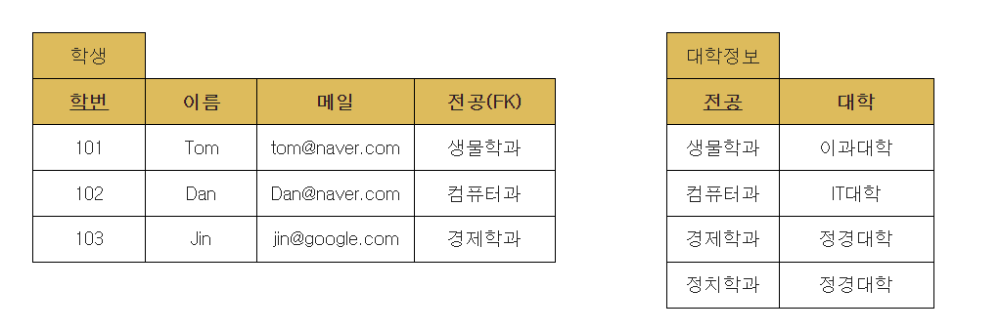

- 결론!! 테이블 정리

그래서 비정규형 테이블이였던 '학생' 테이블을 제 3정규화까지 마치게 될 경우 아래와 같이 정리가 됩니다.

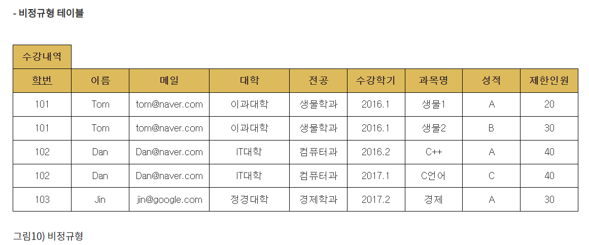
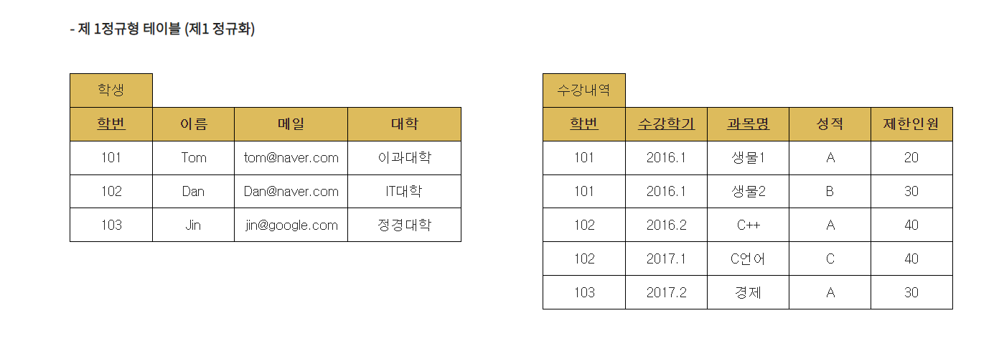
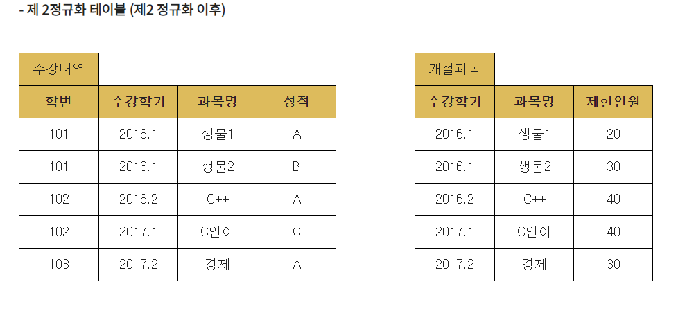
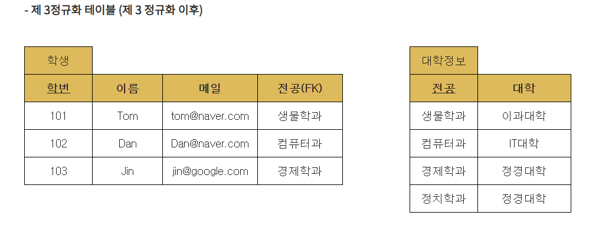
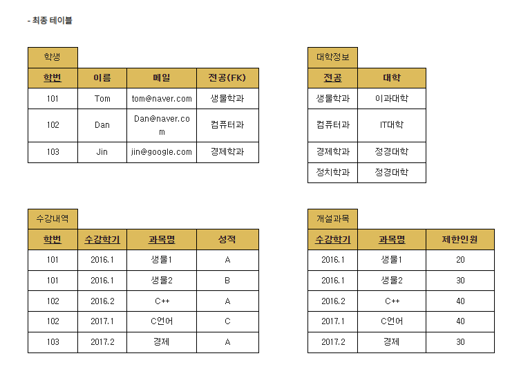

### 정규화 퀴즈

문제
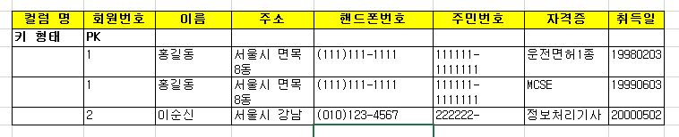
풀이
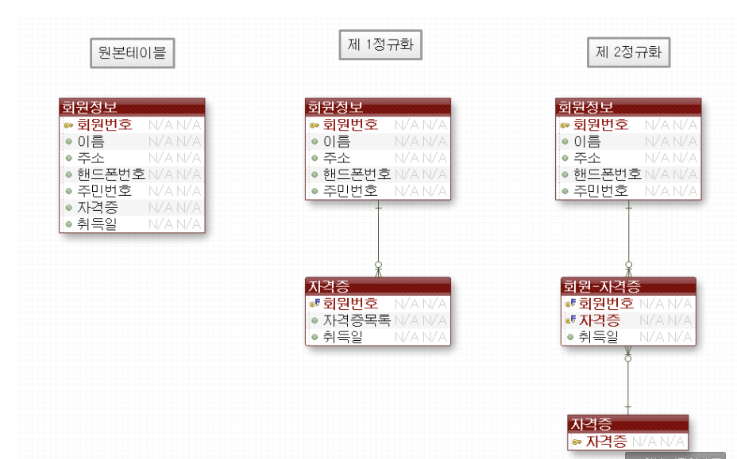
문제
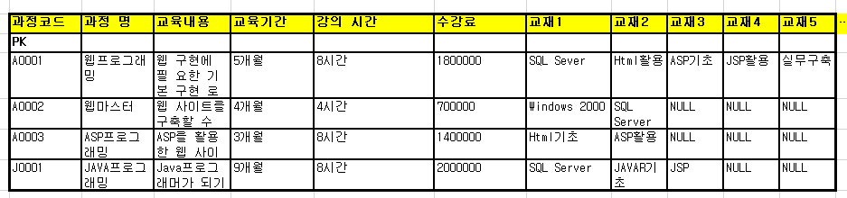
풀이
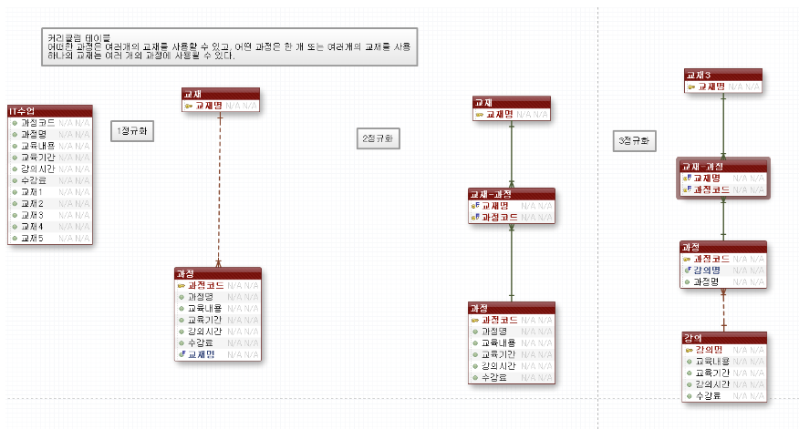
문제
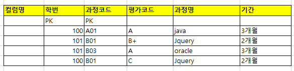
풀이
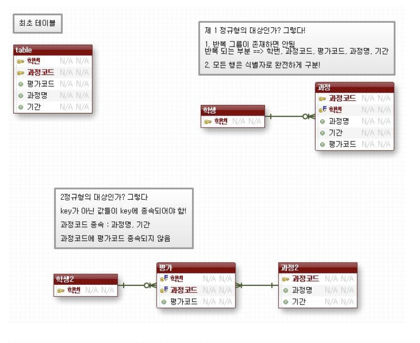
문제
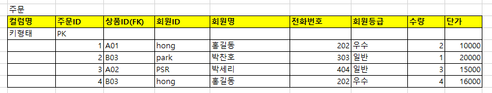
풀이
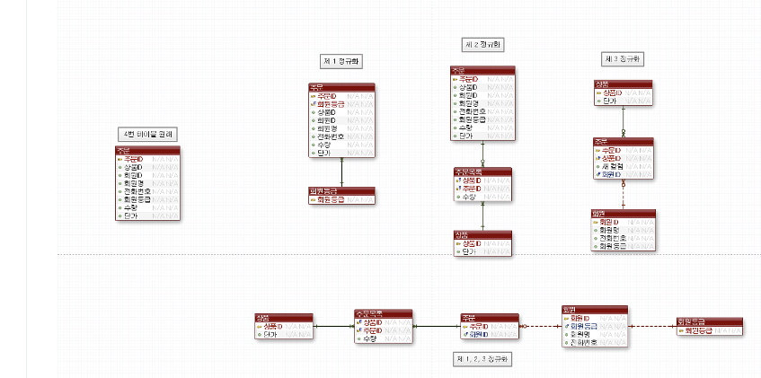

### JSON
