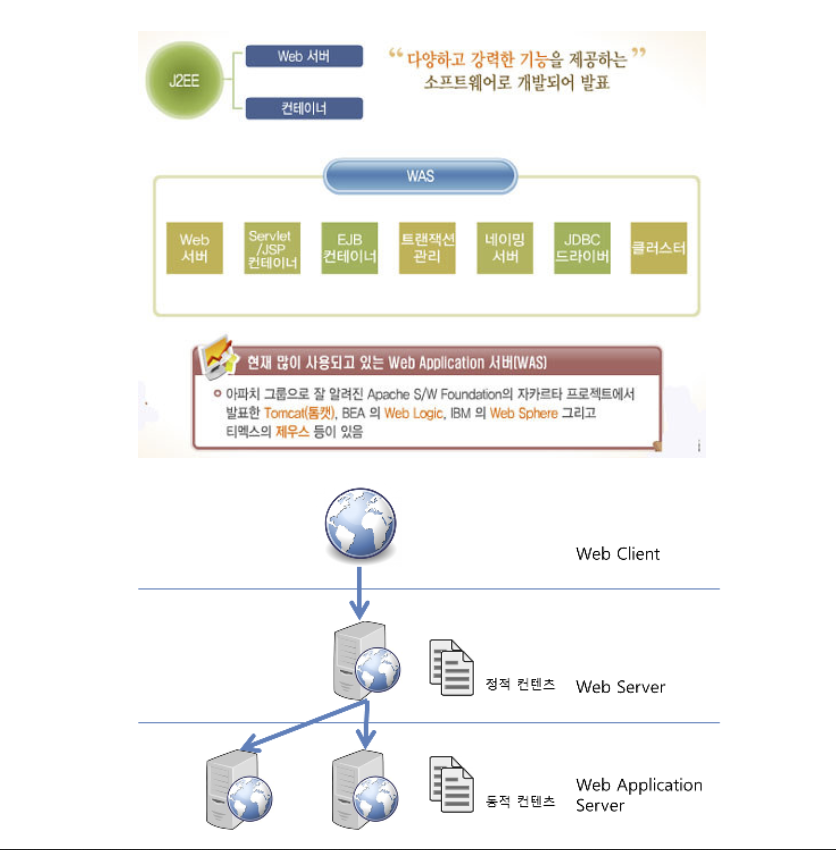
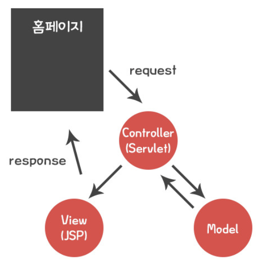
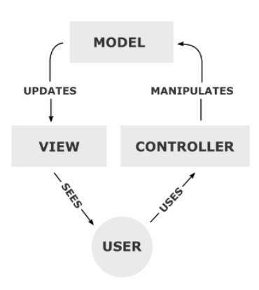
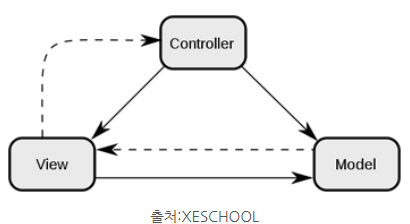
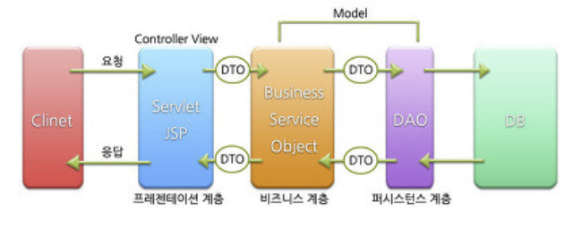

2022.10.20 목요일

### was

WEB 서버는 HTML 문서같은 정적 컨텐츠를 처리하는 것이고 (HTTP 프로토콜을 통해 읽힐 수 있는 문서)

WAS 서버는 asp, php, jsp 등 개발 언어를 읽고 처리하여 동적 컨텐츠, 웹 응용 프로그램 서비스를 처리하는 것이다.

처리하는 기능은 나누어져있지만 요새 WAS 서버에는 WEB서버 기능을 포함하고 있다고 한다.

WAS에 대해서 좀더 살펴보자면, J2EE 스펙을 구현한 서버로

분산 트랜잭션, 보안, 메시징, 쓰레드 처리 등의 기능을 처리하는 분산환경에서 사용되는 미들웨어이다.

웹서버 + 웹 컨테이너로 웹상에서 사용하는 컴포넌트를 올려놓고 사용하게 되는 서버이다.

Web Logic, Jeus, Tomcat, JBoss 등이 있다. Tomcat 같은 경우 WAS가 아니라는 사람들도 있는데 이는 Tomcat에는 EJB 컨테이너로의 기능이 없기 때문이다.

WAS가 컨테이너도 포함될 수 있다고 하는데 이 컨테이너 Containner 무엇이냐면 JSP와 Servlet을 실행시킬 수 있는 SW를 웹 컨테이너라고 한다.

​

JSP를 배울 때 대체적으로 Apache와 Tomcat을 사용한다. Apache는 웹서버를 담당하고 Tomcat은 WAS 다.

ASP를 구동하기 위해서는 IIS를 사용한다. ASP의 환경이 MS계열 서비스라면 WAS의 기능을 담당하는 부분이 있어 별도의 WAS가 필요하지않다.

그렇다면 ASP처럼 하나를 쓰지 않고 WAS와 웹서버가 동시에 왜 필요할까.
우리가 만드는 웹페이지는 정적 컨텐츠만 있는 것도 아니고 동적 컨텐츠도 함께 노출되게 된다.

WAS가 정적 데이터를 처리로 인해 동적 컨텐츠의 처리가 지연이 될 것이고 이로 인한 페이지 노출시간이 늘어나게 된다.

WAS는 동적 처리에 최적화 되어 있는 서비스이기 때문에 처리 속도를 위해, 정적처리는 웹서버에서 처리를 하고, 동적 컨텐츠는 WAS에서 처리하게 된다.

간단히 말하면 분산처리를 위한 것이다.

사용자가 클라이언트(브라우저)에 요청을 하게 되면 이를 웹서버에서 반응하여 WAS의 처리를 거쳐

웹페이지로 다시 웹서버에서 클라이언트(브라우저)에 응답 메세지를 주는 것이다.

[ 정리 ]

WEB 서버가 처리할 수 있는 형태로 가공하여 제공해줄수 있는 웹 어플리케이션 정도가 될까.

WAS를 사용하는 이유는 WEB서버에서는 웹 문서만 처리하도록 기능을 분배하여 서버의 부담을 줄이기 위한 것이라 할 수 있다.

### jsp

jsp는 html안에 자바 코드가 포함된 것으로 서버사이드 스크립트를 말한다. jsp는 실행시에는 Java Servlet 으로 변환된 후 실행되므로 서블릿과 거의 유사하다고 볼 수 있다. 하지만, 서블릿과는 달리 HTML 표준에 따라 작성되므로 웹페이지 작성이 편리해졌다. 클라이언트에서 서비스가 요청되면, JSP의 실행을 요구하고, JSP는 웹어플리케이션 서버(Tomcat)의 서블릿 컨테이너에서 서블릿 원시코드로 변환된다, 그후에 서블릿 원시코드는 바로 컴파일된 후 실행되어 결과를 HTML 형태로 클라이언트에 돌려준다. 이렇게 서블릿과 달리 JSP는 코드를 변경할 때마다 WAS에서 자동으로 빌드하고 클라이언트에 화면을 동적으로 보여주기 때문에 개발이 많이 편리해 졌다.​

​

​

※ Servlet과 JSP 배우기 전에 HTML과 CSS를 알아두면 좋겠다.

​

​

서블릿(Servlet)의 특징

- 동적 웹어플리케이션 일부

- .java 확장자

- Client 요청에 동적으로 작동하고 응답은 html을 이용

- java thread를 이용하여 동작하는 Servlet의 가장 큰 강점이다.

- MVC에서 Controller

​

​

JSP의 특징

- 동적 웹어플리케이션 일부

- .jsp 확장자

- Client 요청에 동적으로 작동하고 응답은 html을 이용

- jsp파일은 .java 파일로 변환되고 컴파일을 거쳐서 .class 파일로 변환되어 실행

(index.jsp 파일이 index_jsp.java로 변환되고 index_jsp.class 로 변환)

- MVC에서 View

​

​

※ 동적 웹 어플리케이션 일부

- 일반적으로 HTML 문서는 정적이다. 연산을 요청 했을 경우 불가능하다, JSP와 Servlet은 동적이기에 가능하다.

​

​

​

먼저 나온 나온것은 서블릿(Servlet)이다.

자바(JAVA) 언어를 개발한 Sun에서 웹 개발을 위해 만들었다.

그래서 JAVA언어로 되어있고, .java가 확장자이다.

서블릿(Servlet)은 JAVA 코드를 작성하고 나서 실행하면 클래스파일(.class)을 만들게 된다.

서블릿의 단점은 JAVA코드가 한줄만 변경되어도 다시 처음부터 실행해야 한다.

​

그 단점을 보완한 것이 JSP 이다.

개인적인 생각으로는 MVC 패턴을 적용하기 위해서 나온거 같기도 하다.

MVC 패턴이라 함은 대충 일단 생각하자면,

서블릿에서 처리한 모든 것들 DB, HTML, JAVA 등등을 분리시킨 방식이다.

​

개인적인 생각으로는 Servlet에서 처리한 것 중

보이는 부분인 HTML은 JSP가,

내부적으로 처리해야하는 JAVA언어와 관련 된 동적인 부분은 Servlet이 하기 위해서가

JSP가 나온 이유 중 하나인 것 같다.

​

### MVC패턴

MVC 는 Model, View, Controller의 약자 입니다. 하나의 애플리케이션, 프로젝트를 구성할 때 그 구성요소를 세가지의 역할로 구분한 패턴입니다.

위의 그림처럼 사용자가 controller를 조작하면 controller는 model을 통해서 데이터를 가져오고 그 정보를 바탕으로 시각적인 표현을 담당하는 View를 제어해서 사용자에게 전달하게 됩니다. 저건 하나의 로직을 설명하기 위해 만든 그림이고 사실 MVC 패턴의 구조는

이 그림이 더 어울릴 것입니다. Controller가 view에도 영향을 미치는(화살표를 보자) 부분이 있어야 합니다.

교수님이 강조하신 사진

MODEL1

## 자바웹을 다루는 기술

<strong>p39</strong>

### 정적 웹프로그래밍

