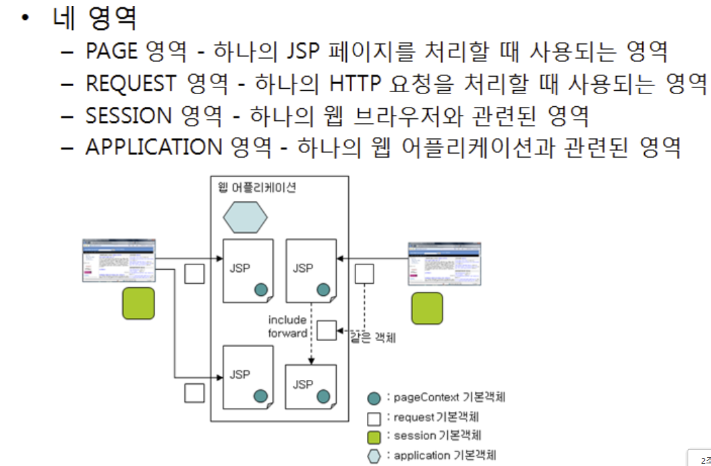
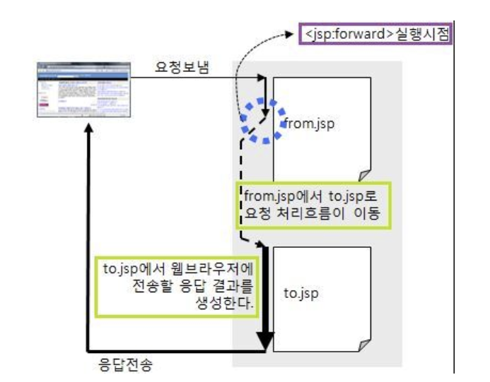
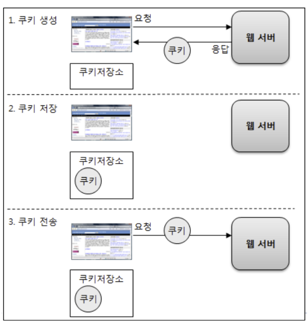

# 2022.10.24 월요일



클라이언트가 요청을 보내면 요청당 하나의 리퀘스트가 만들어지느는데 요청은 종속적이다.

### include param

### forward 액션 태그

JSP 페이지의 프로그램 제어를 이동할 때 사용

페이지의 흐름을 제어함
JSP 페이지 내에서 foward 액션 태그를 만나면  
그전까지 출력 버퍼에 저장되어 있던 내용을 제거한 후 지정 페이지로 이동  
데이터를 공유하면서 페이지를 이동하기 때문에  
forward 액션 태그가 있는 페이지의 URL 주소에서 다른 페이지의 결과를 출력  
모델 2에서는 컨트롤러가 forward 액션 태그와 같은 역할을 함  
사용자가 입력한 값에 따라 접속하는 페이지가 다른 경우에 사용하면 좋음

<jsp:forward page="이동 페이지명"/>  
page 속성의 값으로는 이동할 페이지 기술  
상대 경로, 절대 경로, 표현식으로 지정 가능  
※ page 속성은 include 액션 태그와 동일함

<strong>forward 액션 태그 처리 과정 </strong>
웹 브라우저에서 웹 서버로 a.jsp 페이지 요청  
요청된 a.jsp 페이지 수행

<jsp:forward page="b.jsp"/>  
forward 액션 태그를 만나면 출력 버퍼의 내용을 제거하고  
프로그램 제어를 b.jsp로 이동(포워딩)시킴  
b.jsp 페이지 수행  
b.jsp 페이지를 수행한 결과를 웹 브라우저에 응답  
※ include 액션 태그와 마찬가지로 forward 액션 태그에 의해  
연결된 페이지 간에는 동일한 request 객체를 공유함  


### 예외처리

### 쿠키

정보 (자료)데이터>저장 > 장소(where)

웹이라는 관점에 데이터 어느 장소에 저장
클라이언트(개인 로컬 pc:) : 서버 ( 웹서버 or DB서버)

어디에 저장 (보관)

고민 ( 기준점) : 보안 요소( 데이터 중요성), 소멸(일시적, 영속적)

보안 : 클라이언트<>서버
소멸: 메모리와 DB or 파일

클라이언트( local pc : 웹브라우져)

1. Cookie( 메모리 쿠키와 파일 쿠키 (local 디스크에 txt저장> 암호화))>>소멸시기
   단점) 크기 제한적 (4096byte), 보안( 사용자 삭제.. 암호화 해독 해커..)
2. local storage(key,value) 형태
   장점) 크기, value(객체 사용 가능 : JSON)

   server(웹서버 (메모리) +DB 서버)

   1. server memory : session 객체
   2. server memory: : application 객체
   3. server영속적 : 파일.txt(관리자 힘들다)

3. DB server : 보안, 영속적인 데이터 관리>> 비용은 추가>> 클라우드 사용



쿠키 생성하기

```java

// 쿠키 생성
Cookie cookie = new Cookie("cookieName", "value1");

// 쿠키 값 재설정
cookie.setValue("value2");

// 쿠키 유지 시간 설정(초단위)
cookie.setMaxAge(60*2);

// 쿠키를 클라이언트로 전송
response.addCookie(cookie);
```

쿠키 읽어오기

```java

Cookie[] cookies = request.getCookies(); //client에서 쿠키를 받아옴

String cookieName = "";
String cookieValue = "";

if(cookies!=null){
    for(int i=0;i<cookies.length;i++){
        if(cookies[i].getName().equals("cookieName")){
            cookieName = cookies[i].getName();
            cookieValue = cookies[i].getValue();
        }
    }
}

```

request.getCookies()로 클라이언트에서 쿠키 정보를 배열 형태로 받아옵니다.

쿠키의 읽기 관련 메소드에 대해서는  
length로 쿠키의 개수,  
getName()으로 쿠키의 이름,  
getValue()로 쿠키의 값을 반환받습니다.

쿠키 삭제하기

```java
if(cookies != null){
    for(int i=0; i < cookies.length; i++){
    	// 쿠키 유지시간은 0으로 설정
        cookies[i].setMaxAge(0);

        // 변경된 쿠기 정보를 다시 클라이언트에 전달
        response.addCookie(cookies[i]);
    }
}


```

쿠키 삭제는 setMaxAge() 메소드를 사용해 유지 시간을 0으로 설정해 만료시키는 방법이 있습니다.

만약 특정 쿠키를 삭제하려면 if문으로 원하는 쿠키 이름을 리턴 받은 후 설정하시면 됩니다.

마지막으로 만료시킨 쿠키를 클라이언트에 전달한 후 마무리합니다.  
출처: https://lasbe.tistory.com/88 [LasBe's Upgrade:티스토리]

### json (parse함수, Stringfy 함수)

```java

```

### session

```java

```

```java

```
