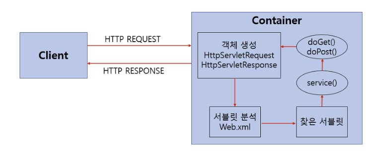

# 2022.10.26

## [JSP] 서블릿(Servlet)이란?

서블릿을 한줄로 정의 하면  
     클라이언트의 요청을 처리하고, 그 결과를 반환하는 Servlet 클래스의 구현 규칙을 지킨 자바 웹 프로그래밍 기술
간단히 말해서, 서블릿이란 자바를 사용하여 웹을 만들기 위해 필요한 기술입니다. 그런데 좀더 들어가서 설명하면 클라이언트가 어떠한 요청을 하면 그에 대한 결과를 다시 전송해주어야 하는데, 이러한 역할을 하는 자바 프로그램입니다.   
예를 들어, 어떠한 사용자가 로그인을 하려고 할 때. 사용자는 아이디와 비밀번호를 입력하고, 로그인 버튼을 누릅니다. 그때 서버는 클라이언트의 아이디와 비밀번호를 확인하고, 다음 페이지를 띄워주어야 하는데, 이러한 역할을 수행하는 것이 바로 서블릿(Servlet)입니다. 그래서 서블릿은 자바로 구현 된 \*CGI라고 흔히 말합니다.

[ Servlet 특징 ]

- 클라이언트의 요청에 대해 동적으로 작동하는 웹 어플리케이션 컴포넌트
- html을 사용하여 요청에 응답한다.
- Java Thread를 이용하여 동작한다.
- MVC 패턴에서 Controller로 이용된다.
- HTTP 프로토콜 서비스를 지원하는 javax.servlet.
- http.HttpServlet 클래스를 상속받는다.UDP보다 처리 속도가 느리다.
- HTML 변경 시 Servlet을 재컴파일해야 하는 단점이 있다.

### 서블릿 동작방식

1. 사용자(클라이언트)가 URL을 입력하면 HTTP Request가 Servlet Container로 전송합니다.
2. 요청을 전송받은 Servlet Container는 HttpServletRequest, HttpServletResponse 객체를 생성합니다.
3. web.xml을 기반으로 사용자가 요청한 URL이 어느 서블릿에 대한 요청인지 찾습니다.
4. 해당 서블릿에서 service메소드를 호출한 후 클리아언트의 GET, POST여부에 따라 doGet() 또는 doPost()를 호출합니다.
5. doGet() or doPost() 메소드는 동적 페이지를 생성한 후 HttpServletResponse객체에 응답을 보냅니다.
6. 응답이 끝나면 HttpServletRequest, HttpServletResponse 두 객체를 소멸시킵니다.

#
