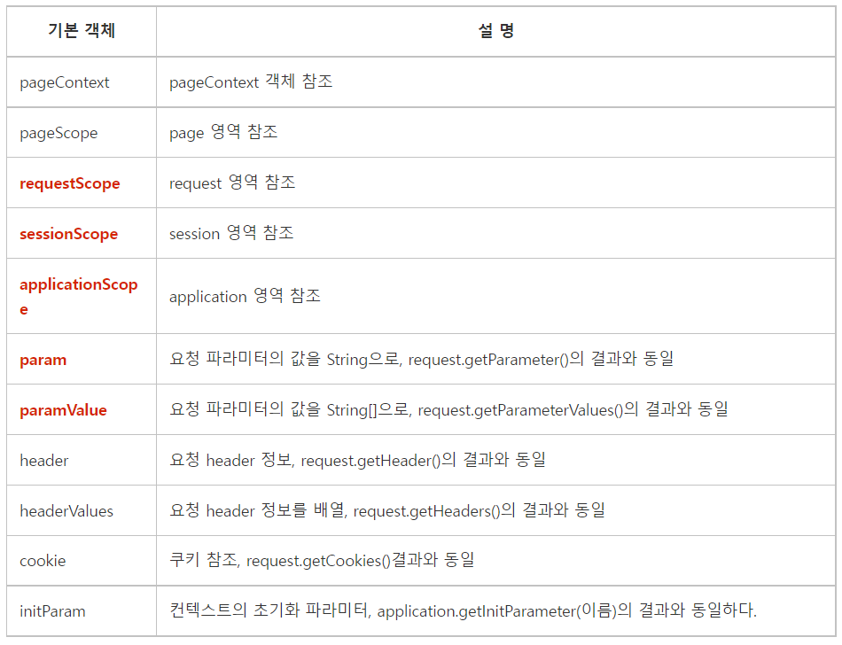
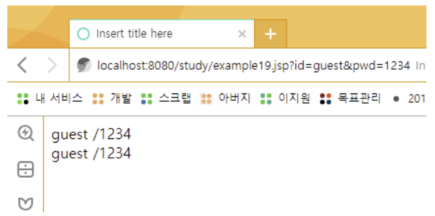
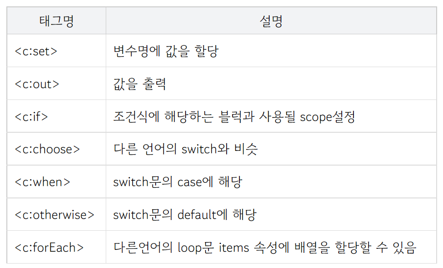
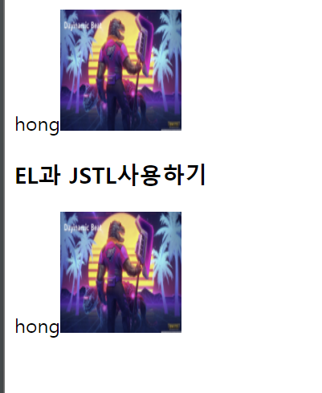
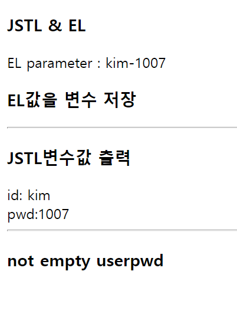
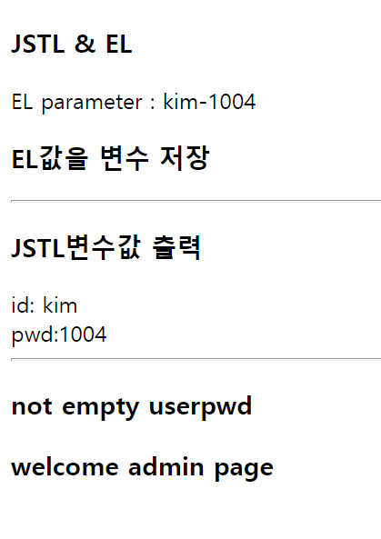
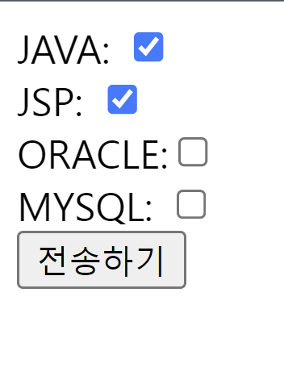
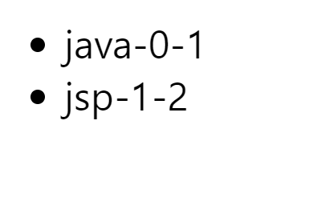
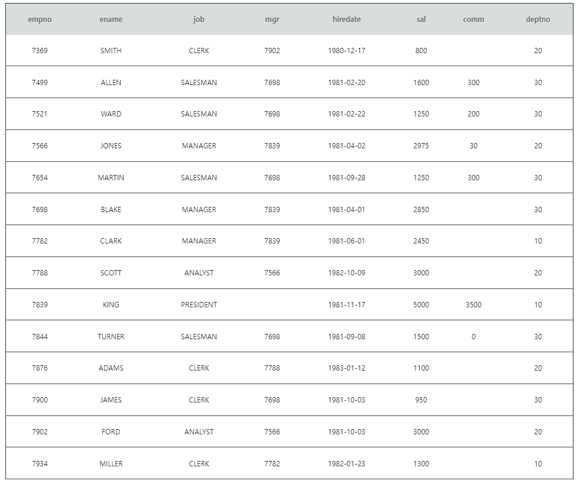

# 2022.10.26

### EL

- jsp에는 스크립트의 값을 간결하고 편리하게 사용할 수 있는 표현언어를 사용할 수 있다.

- jsp에는 개발자가 직접 정의한 커스텀 태그라는 것도 사용할 수 있는데, 커스텀 태그들중 많이 사용되는 것들을 모 아서 제공하는 JSTL(JSP Standard Tag Library 표준태그 라이브러리)이라는 커스텀 태그가 있다.

1. EL

① EL 표현식

EL은 "$"와 "{}"를 사용하여 값을 표현한다. {}안에는 값으로 표현되는 것만 와야 한다.

ex)

x변수의 값을 출력하고 싶으면 ${x}

배열변수 arr의 1번째 인덱스의 값을 출력하고 싶으면 ${arr[0]} or ${arr['0']}

member변수의 getName()값을 출력하고 싶으면 ${member.name} or ${member['name']}

② EL 기본객체(내장객체)

EL에는 jsp/servlet의 객체(pageContext제외)의 속성값이나 파라미터 값등을 쉽게 표현하기 위해서 기본객체를 제공한다.

- EL(Expression Language)이 제공하는 11개의 기본 객체


ex)

${requestScope.data} --> request.getParameter("data");

${sessionScope.id} --> session.getParameter("id");

${applicationScope.address} --> application.getParameter("address");

※ scope는 생략이 가능하다. ${sessionScope.id}를 ${id}라고 표현할 수 있다. 생략하면 작은 영역순으로 찾게 된다.

request에서 id를 찾고, 없으면 session 없으면, application순으로...

③ EL의 연산자

표현식 {}안에서 연산자(수치, 비교, 논리, empty, !empty) 사용이 가능하다.

ex)

${1+2} --> 3

${"1"+2} --> 3 : "1"을 숫자 1로 변환후 연산

${"일"+2} --> 에러!

${null + 1} --> 1 : null을 숫자 0로 변환후 연산

${3/2} --> 1.5 나누기 연산은 double타입으로 변환뒤 연산

${2==2} --> true  
${2!=2} --> false
${2>1} --> true

${true && false} --> false

${true || false} --> true

${!false} --> true

${empty x} --> x의 값이 null이면 true

${!empty x} --> x의 값이 null이 아니면 true

param 활용 예시

```html
<%@ page language="java" contentType="text/html; charset=UTF-8"
pageEncoding="UTF-8"%>
<!DOCTYPE html>
<html>
  <head>
    <meta charset="UTF-8" />
    <title>Insert title here</title>
  </head>
  <body>
    ${param.id} /${param.pwd} <br />
    ${param["id"]} /${param["pwd"]} <br />
  </body>
</html>
```



미완성

## JSTL

### 1. JSTL이란?

일반적으로 알고있는 JSTL이란 JSTL + EL의 조합을 말한다.

HTML 코드 내에 java 코드인 스크립틀릿 <%= student %>를 ${student}로, <%=if %>문을 <c:if>, <%=for%>문을 <c:forEach>로 대체하여 사용한다.

예전에는 스크립틀릿을 많이 사용했지만 가독성이 떨어지고, 뷰와 비즈니스로직의 분리로 인해 현재는 JSTL을 많이 사용하는 추세다. JSTL과 EL은 보통 함께 사용하는데 그 이유와 각각의 개념, 각각의 차이와 문법을 정리해보도록 하자.

### JSTL의 사용법

JSTL은 라이브러리이기 때문에 사용하기전에 core를 header에 추가해주어야 한다.

```html
<% @taglib uri="http://java.sun.com/jstl/core" prefix="c" %>
```

사용방법은 다음과 같다.

```html
<c:if test=""></c:if> <c:forEach items=""></c:forEach>
```

### JSTL core의 태그들



### jstl basic

```jsp
<%@page import="java.util.HashMap"%>
<%@page import="kr.or.kosa.Emp"%>
<%@ page language="java" contentType="text/html; charset=UTF-8"
    pageEncoding="UTF-8"%>
    <%@ taglib prefix="c" uri="http://java.sun.com/jsp/jstl/core" %><!-- jsp 파일이 외부 라이브러리를 받는 방법  -->

    <%
    Emp e= new Emp(2000,"kosauser");

    HashMap<String, String>hp= new HashMap<>();
    hp.put("data", "1004");

    request.setAttribute("emp", e);// 이렇게 하면 EL이 사용할 수 있다!

    %>
<!DOCTYPE html>
<html>
<head>
<meta charset="UTF-8">
<title>Insert title here</title>
</head>
<body>
<!-- 기존 방식대로 출력하려고 할 때  -->
<h3>기존방식</h3>
<%=e %><br>
<%=e.getEmpno()	 %><br>
<%=e.getEname() %><br>

<h3>EL 출력</h3>
 EL(x) 자바 객체 출력( 자바객체에 대한 직접 접근불가):${e }<br>
 EL (x): ${e.getEmpno() }<br>
 <!-- EL 출력
EL :
EL :
 이렇게 출력된다.
 -->
 <h3>해결사</h3>
 1.  request 객체 또는 session 객체에 담는다.**** <br><!--어짜피 포워드 할 껀데  굳이 ?? 이런 마인드로 안만들지 않았을까?  -->
 EL :${requestScope.emp }<br>
 2. JSTL 사용해서 처리<br>

 <h3>JSTL(core) : 변수생성, 제어문( 자바코드 도움 없이): 이렇게 만든 JSTL은 서버에서 실행되고 해석되는 자원이다. 서버스크립트다 스크립트가 아니다!</h3>
 <c:set var="m" value="<%=e %>"/>
 JSTL 사용해서 변수 m을 생성 ( EL을 사용해서 접근 가능하다.) :${m }<br>
 getter 함수(권장 방법은 아님):${m.getEmpno() }<br>

 EL 출력 ( m.memberfield 명 : 자동으로 getter 호출한다.): ${m.empno }<br><!--굳이 getter setter 할 필요 없다.  -->
  EL 출력 ( m.memberfield 명 : 자동으로 getter 호출한다.): ${m.empno=1000 }<br>
   EL 출력 ( m.memberfield 명 : 자동으로 getter 호출한다.): ${m.ename}<br>

 <!--
 EL : 출력목적>> 변수, 제어구조 없어요
 JSTL : EL을 도와서 변수, 제어구조 , 출력을 도와준다.

   -->
 <c:set var="username" value="${m.ename }"/><!--마치 자바의 변수를 만드는 것과 똑같다.  -->
 변수값 출력 :${username}<br>
 <h3>JSTL 변수 만들고 Scope정의하기</h3>
 <c:set var="job" value="농구선수" scope="request"/>
 당신의 직업은 : ${job }<br>
 만약에 당신이 include, forward 통해서 페이지를 제어하면 그 페이지에서 EL 통해서 job이라는 변수 값을 출력 할 수 있다.

 <hr>
 <!--잘 안쓰지만 재밌는 기능 -->
 <c:set var="job2" value="야구선수"/>
 값출력 : ${job2 }<br>
 만든변수를 삭제할 수 있는 기능(잘쓰지 않는다. )<br>
 <c:remove var="job2"/>
 값출력(삭제된 값) : ${job2 }<br><!--삭제된 값을 출력해도 예외가 발생하지 않고 결과가 안나오고 만다.   -->

 <hr>
 java api 가 제공하는 객체도 접근 가능할까?? : ${hp }<br>
 1. request 또는 session에다가 담느다.(권장사항)<br>
 2. JSTL 사용한다.<br>

 <c:set var="vhp" value="<%=hp %>"/><!--value 값에다가 스크립트 블럭스크립트 블럭을 쓸 수 밖에 없기때문에 최대한 쓰지 말자-->
 hp 객체 : ${vhp }<br>
 hp 객체 : ${vhp.data}<br>

 <hr>
 값을 write (hp.put{"color","red")): 그냥 구경만...
 <c:set target="${vhp }" property="color" vlaue="red"/>
 hp 객체 : ${vhp }<br><!--jstl이 java의 영역을 침범할 필요가 없다.  -->
</body>
</html>
```

### 이미지를 출력하는 방법을 jstl로 해보자

```jsp
<%@ page language="java" contentType="text/html; charset=UTF-8"
    pageEncoding="UTF-8"%>
    <%
    String id=request.getParameter("ID");
    if(id.equals("hong")){
    	%>
    <%=id%>
   <%
    }
    %>
<!DOCTYPE html>
<html>
<head>
<meta charset="UTF-8">
<title>Insert title here</title>
</head>
<body>
<h3>EL과 JSTL사용하기</h3>
<!--
${param.ID}>> request.getParameter("ID")랑 똑같다!

  -->
  <c:if test="${param.ID=='hong' }"><!--     if(id.equals("hong")){와 같다!!!! -->
  ${param.ID }
  </c:if>
    <h3>JSTL IF문</h3>
 <!--   http://localhost:8090/WebJSP_EL_JSTL/Ex04_EL_JSTL.jsp?ID=hong%age=100
-->
<c:if test="${ param.age > 20 }" var="result"> <!-- JSPL은 if else 가 없음 -->
        param.value : ${ param.age}
     </c:if>
     <hr>
     if문 var라는 변수를 만들면 : ${result}
<!--오타 찾기  -->
</body>
</html>
```

출력화면(http://localhost:8090/WebJSP_EL_JSTL/Ex04_EL_JSTL.jsp?ID=hong)


### jstl 구문 테스트

```jsp
*/
%>
<!DOCTYPE html>
<html>
<head>
<meta charset="UTF-8">
<title>Insert title here</title>
</head>
<body>
	<h3>JSTL & EL</h3>
	EL parameter : ${param.id }-${param.pwd }
	<br>

	<h3>EL값을 변수 저장</h3>
	<c:set var="userid" value="${param.id }" />
	<c:set var="userpwd" value="${param.pwd }" />

	<hr>
	<h3>JSTL변수값 출력</h3>
	id: ${userid}
	<br> pwd:${userpwd}
	<br>
	<hr>
	<c:if test="${!empty userpwd }">
		<!--userpwd 가 비어있지 않다면 , 비번이 존재한다면  -->
		<h3>not empty userpwd</h3>
		<c:if test="${userpwd=='1004' }">
			<h3>welcome admin page</h3><!--else가 없으니깐 계속 if 걸어야한다.  -->
		</c:if>
	</c:if>
<!-- http://localhost:8090/WebJSP_EL_JSTL/Ex_05_JSTL.jsp?id=kim&pwd=1007
	   http://localhost:8090/WebJSP_EL_JSTL/Ex_05_JSTL.jsp?id=kim&pwd=1004
 -->
</body>
</html>
```

pwd=1007  
  
pwd=1004  


### jstl 활용

```html
<%@ page language="java" contentType="text/html; charset=UTF-8"
    pageEncoding="UTF-8"%>
 <%@ taglib prefix="c" uri="http://java.sun.com/jsp/jstl/core" %>
<!DOCTYPE html>
<html>
<head>
<meta charset="UTF-8">
<title>Insert title here</title>
</head>
<body>
   <h3>JSTL</h3>
   <!--
   java 코드
   int sum=0;
   for(int i = 0 ; i <= 10 ; i++){sum+=1}

   for(String str : list){ }
   -->
   <c:forEach var="i" begin="0" end="10">
      <c:set var="sum" value="${sum+i}"/>
      <b>${i}</b><br>
   </c:forEach>
   sum : 누적값 ${sum}<br>

   <h3>구구단 5단을 출력(forEach)</h3>
      <ul>
         <c:forEach var="i" begin="1" end="9">
            <li>5*${i}=${5*i}</li>
         </c:forEach>
      </ul>
   <h3>EL & JSTL 구구단 출력하기 (중첩 forEach)</h3>
   <table border="1">
      <c:forEach var="i" begin="2" end="9">
         <c:forEach var="j" begin="0" end="9">
            <c:choose>
               <c:when test="${j == 0}">
                  <tr bgcolor="gold"><th>${i}단</th></tr>
               </c:when>
               <c:otherwise>
                  <tr><td>${i}*${j}=${i*j}</td></tr>
               </c:otherwise>
            </c:choose>
         </c:forEach>
      </c:forEach>
   </table>

   <h3>   h3 JSTL forEach 사용하기</h3>
<%
int[] arr= new int []{10,20,30,40,50};
for( int i:arr){
	out.print("출력값:<b><i>"+i+"</i></b><br>");

}

%>
<h3>EL에서 java 객체 접근 불가(1.request, 2. JSTL)</h3>
<c:set var="intarr" value="<%=arr %>"/>
EL접근 : ${intarr }<br>
<hr>
<h3>******for Each(items)개선된 for문*****</h3>
<c:forEach var="arr" items="${intarr }">
배열값 : ${arr }<br>
</c:forEach>
<h3>단순하게</h3>
<c:forEach var="i" items="<%=arr %>">
배열값 : ${i}<br>
</c:forEach>
<h3>재미삼아서</h3>
<c:forEach var="i" items="<%=new int[]{1,2,3,4,5} %>">
배열값3 : ${i}<br>
</c:forEach>
<h3>forEach 속성 활용하기(옵션)</h3>
<c:forEach var="i" items="${intarr }" varStatus="status">
index: ${ status.index }&nbsp;&nbsp;&nbsp;
count : ${status.count }&nbsp;&nbsp;&nbsp;
value : ${i}<br>
</c:forEach>
<h3>today point (데이터는 한건 이상 : 게시판)</h3>
	<%
	//우리가 다루는 데이터는 1건 이상
	//select ...여러건
	//public List<Emp> getEmpList(){...}
	//JSP 출력 목적( 게시판 처리)
	List<Emp> emplist = new ArrayList<>();

	emplist.add(new Emp(100, "A"));
	emplist.add(new Emp(200, "B"));
	emplist.add(new Emp(300, "C"));
	//3건의 데이터가 ArrayList안에 .. 출력 목적

	//자바라면
	for (Emp e : emplist) {
		out.print(e.getEmpno() + " / " + e.getEname() + "<br>");
	}

	//UI JSP(EL JSTL을 쓰는게 목적이다!!)
	//1. request 에 담는다. 나중에는 servlet이 하는일이다.

	request.setAttribute("list", emplist);

	//forward 가정하고
	//jsp 페이지에서
	%>
	<h3>회원 데이터 출력하기(EL&JSTL) 중요하다!!!!!!!</h3>
	<c:set var="elist" value="<%=emplist%>" />
	<!-- 이미 위에서 request.set 처리 했다면 위 코드는 안해도 돼요 -->

	<table border="1">
		<tr>
			<td>사번</td>
			<td>이름</td>
		</tr>
		<c:forEach var="emp" items="${requestScope.list}">
			<tr>
				<td>${emp.empno}</td>
				<td>${emp.ename}</td>
			</tr>
		</c:forEach>
	</table>

  <h3>java Map 객체 EL & JSTL 사용해서 출력</h3>
	<%
	Map<String, Object>hm= new HashMap<>();

	hm.put("name", "hong");
	hm.put("pwd", "1004");
	hm.put("date", new Date());

	//view
	request.setAttribute("hmobj", hm);
	%>
	<c:set var="hm" value="<%=hm %>"/>
	<c:forEach var="obj" items="${hm }">
	${obj.key }->${obj.value }<br>
	</c:forEach>
	<!--각각을 뽑으려면  -->

	key : name > ${hm.name }<br>
	key : pwd > ${hm.pwd }<br>
	key : date > ${hm.date }<br>
  <hr>
  <h3>기타 옵션</h3>
	<h3>JSTL 구분자 기준 처리</h3>
	<c:forTokens var="token" items="A.B.C.D" delims=".">
	 	${token}<br>
	</c:forTokens>


	<h3>JSTL 복합구분자 기준 처리</h3>
	<c:forTokens var="token" items="A.B/C-D" delims="./-">
	 	${token}<br>
	</c:forTokens>
	<br>
	<!--
	 	forEach step = -1
	 	편법
	 	기타
	   -->
	   <h3>순서를 거꾸로 출력해라!</h3>
	<c:set var="nownum" value="10" />
	<c:forEach var="i" begin="0" end="${nownum}" step="1">
	   		${nownum - i}<br>
	</c:forEach>
</body>
</html>
```

### 문제 1

```jsp
<%
	String name = request.getParameter("name");
	if(name.equals("kglim")){
		out.print("<b>" + name + "</b>");
	}else if(name.equals("hong")){
		out.print("<i>" + name + "</i>");
	}else{
		out.print("<h3>" + name + "</h3>");
	}
	out.print("<hr>");

%>
```

위를 jstl로변환해라

```html
<%@ page language="java" contentType="text/html; charset=UTF-8"
pageEncoding="UTF-8"%> <%@ taglib prefix="c"
uri="http://java.sun.com/jstl/core_rt"%>

<!DOCTYPE html>
<html>
  <head>
    <meta charset="UTF-8" />
    <title>Insert title here</title>
  </head>
  <body>
    <c:set var="name" value="${param.name }" />
    <c:choose>
      <c:when test="${name eq 'kglim' }">
        <b>${name }</b>
      </c:when>
      <c:when test="${name eq 'hong'}">
        <i>${name }</i>
      </c:when>
      <c:otherwise>
        <h3>${name }</h3>
      </c:otherwise>
    </c:choose>
    <hr />
  </body>
</html>
```

### 문제 2

subject 다중값을 받아서 choose 구문을 사용하여 값이 하나도 선택되지 않았다면  
"선택을 하세요" 라는 문자를 출력하고
값이 하나라도 넘어 왔다면 ... <ul><li>java-0-1</li><li>jsp-1-2</li></ul> 과 같은 형식으로
출력하도록 forEach 를 작성하세요  
추가사항) 출력시 값-index-count 형식으로 나오게 출력하세요

```html
<!DOCTYPE html>
<html>
  <head>
    <meta charset="UTF-8" />
    <title>Insert title here</title>
  </head>
  <body>
    <form action="Ex08_EL_JSTL_QUIZ.jsp" method="post">
      JAVA: <input type="checkbox" name="subject" value="java" /><br />
      JSP: <input type="checkbox" name="subject" value="jsp" /><br />
      ORACLE:<input type="checkbox" name="subject" value="oracle" /><br />
      MYSQL: <input type="checkbox" name="subject" value="mysql" /><br />
      <input type="submit" value="전송하기" />
    </form>
  </body>
</html>
```



```html
<%@ page language="java" contentType="text/html; charset=UTF-8"
	pageEncoding="UTF-8"%>
<%@ taglib prefix="c" uri="http://java.sun.com/jsp/jstl/core"%>

<%
//request.getParameter(name)   >> jsp?id=kglim&pwd=1004
//String[] hobby = request.getParameterValues("subject")  >>jsp?subject=농구&subject=축구

//JSTL : paramValues   >> java : request.getParameterValues
%>
<!DOCTYPE html>
<html>
<head>
<meta charset="UTF-8">
<title>Insert title here</title>
</head>
<body>
		<c:set var="subject" value="${paramValues.subject }"></c:set>
	<c:choose>
		<c:when test="${subject!=null }">
			<ul>
				<c:forEach var="i" items="${paramValues.subject }"
					varStatus="status">
					<li>${i}-${ status.index }-${status.count }<br>
					</li>
				</c:forEach>
			</ul>
		</c:when>
		<c:otherwise>
			<h3>선택을 하세요</h3>
		</c:otherwise>
	</c:choose>
	<!--
		subject 다중값을 받아서 choose 구문을 사용하여 값이 하나도 선택되지 않았다면
		"선택을 하세요" 라는 문자를 출력하고
		값이 하나라도 넘어 왔다면 ... <ul><li>java-0-1</li><li>jsp-1-2</li></ul> 과 같은 형식으로
		출력하도록  forEach 를 작성하세요
		추가사항) 출력시  값-index-count 형식으로 나오게 출력하세요
	 -->
</body>
</html>
```



### 문제3

종합 퀴즈 (조별 퀴즈)

EMP 테이블에서 사원전체 데이터를 출력하는 DTO , DAO 를 작성하세요 (JDBC 참고)  
그리고 그 데이터 14건을
EL & JSTL 을 사용해서 출력하세요  
단)부트템플릿 사용하세요

```html
<%@page import="kr.or.kosa.Emp"%> <%@page import="java.util.List"%> <%@page
import="kr.or.kosa.EmpDao"%> <%@page import="UTILS.SingletonHelper"%> <%@page
import="java.sql.Connection"%> <%@ page language="java" contentType="text/html;
charset=UTF-8" pageEncoding="UTF-8"%> <%@ taglib prefix="c"
uri="http://java.sun.com/jsp/jstl/core"%> <% /* 종합 퀴즈 (조별 퀴즈) EMP
테이블에서 사원전체 데이터를 출력하는 DTO , DAO 를 작성하세요 (JDBC 참고) 그리고
그 데이터 14건을 EL & JSTL 을 사용해서 출력하세요 단)부트템플릿 사용하세요 */
request.setAttribute("list", new EmpDao().getEmpAllList()); %>
<!DOCTYPE html>
<html>
  <head>
    <meta charset="UTF-8" />
    <title>Insert title here</title>
    <!-- CSS only -->
    <link
      href="https://cdn.jsdelivr.net/npm/bootstrap@5.2.2/dist/css/bootstrap.min.css"
      rel="stylesheet"
      integrity="sha384-Zenh87qX5JnK2Jl0vWa8Ck2rdkQ2Bzep5IDxbcnCeuOxjzrPF/et3URy9Bv1WTRi"
      crossorigin="anonymous"
    />
    <!-- JavaScript Bundle with Popper -->
    <script
      src="https://cdn.jsdelivr.net/npm/bootstrap@5.2.2/dist/js/bootstrap.bundle.min.js"
      integrity="sha384-OERcA2EqjJCMA+/3y+gxIOqMEjwtxJY7qPCqsdltbNJuaOe923+mo//f6V8Qbsw3"
      crossorigin="anonymous"
    ></script>
  </head>
  <body>
    <div class="container">
      <table border="1">
        <thead>
          <tr>
            <th scope="col">empno</th>
            <th scope="col">ename</th>
            <th scope="col">job</th>
            <th scope="col">mgr</th>
            <th scope="col">hiredate</th>
            <th scope="col">sal</th>
            <th scope="col">comm</th>
            <th scope="col">deptno</th>
          </tr>
        </thead>
        <tbody>
          <c:forEach var="emp" items="${requestScope.list}">
            <tr>
              <td>${emp.empno}</td>
              <td>${emp.ename}</td>
              <td>${emp.job}</td>
              <td>${emp.mgr}</td>
              <td>${emp.hiredate}</td>
              <td>${emp.sal}</td>
              <td>${emp.comm}</td>
              <td>${emp.deptno}</td>
            </tr>
          </c:forEach>
        </tbody>
      </table>
    </div>
  </body>
  <style>
    .container {
      width: 100vw;
      height: 100vh;
      display: flex;
      align-items: center;
      justify-content: center;
    }

    table {
      border-collapse: collapse;
      width: 50vw;
    }

    th,
    td {
      padding-top: 2vh;
      padding-bottom: 2vh;
      text-align: center;
    }

    tbody > th,
    td {
      border-bottom: 1px solid #444444;
    }

    thead {
      background-color: #d5dedc;
      color: #5f7065;
    }
  </style>
</html>
```


