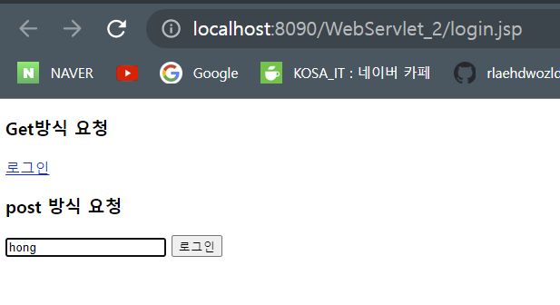
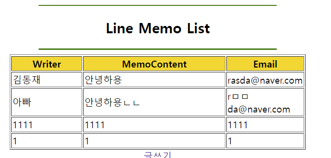

# 2022.10.27 목요일

## JSTL

### jstl 예외처리

```jsp
<h3>예외처리</h3>
	<!--
c:catch> 안에 구문이 예외가 발생하면 예외 객체가 생성되고
예외 객체 주소를 받아서 처리 할 수 있다.

var="msg" 자바에서는 Exception msg
  -->
	<c:catch var="msg">
		name:<%=request.getParameter("name")%>
		<%
		if (request.getParameter("name").equals("hong")) {
			out.print("당신으 이름은 : " + request.getParameter("name"));
		}
		%>

	</c:catch>
	<c:if test="${ msg !=null}"></c:if>
	<h3>예외발생</h3>
	오류 메시지 : ${msg }<br>

```

### jstl 문단태그

```jsp
<p>문단태그</p>
	<hr>
	<p></p>
	태그는 문단태그입니다. &lt;p&gt; 태그는 설명.....

	<hr>
```

### jstl 포맷

```jsp
<%@ page language="java" contentType="text/html; charset=UTF-8"
	pageEncoding="UTF-8"%>
<%@ taglib prefix="c" uri="http://java.sun.com/jsp/jstl/core"%>
<!DOCTYPE html>
<html>
<head>
<meta charset="UTF-8">
<title>Insert title here</title>
</head>
<body>
<%@page import="java.util.Date"%>

<%@ taglib prefix="c" uri="http://java.sun.com/jsp/jstl/core" %>
<%@ taglib prefix="fmt" uri="http://java.sun.com/jsp/jstl/fmt" %>
<!DOCTYPE html>
<html>
<head>
<meta charset="UTF-8">
<title>JSTL Fmt 포맷관련</title>
</head>
<body>
 <h3>숫자관련</h3>
 변수선언 : <c:set var="price" value="1000000"></c:set><br>
 변수값 출력:${price}<br>

 <fmt:formatNumber value="${price}" type="number" /><br>
 <fmt:formatNumber value="50000000" type="currency" currencySymbol="$" /><br>
 <fmt:formatNumber value="0.13"     type="percent"/>
 변수에 설정 <br>
 <fmt:formatNumber value="123456789" pattern="###,###,###" var="pdata" />
 변수에 설정한 값 : ${pdata}<br>

 <hr>
 <h3>날짜 관련 format</h3>
 변수선언 : <c:set var="now" value="<%= new Date() %>" /><br>
 변수값 : ${now}<br>
 Basic Date : <fmt:formatDate value="${now}" type="date" /><br>
 DateStyle(full) : <fmt:formatDate value="${now}" type="date" dateStyle="full" /><br>
 DateStyle(short) : <fmt:formatDate value="${now}" type="date" dateStyle="short" /><br>
 시간:<fmt:formatDate value="${now}" type="time"/><br>
 날짜 + 시간:<fmt:formatDate value="${now}" type="both"/><br>
 혼합:<fmt:formatDate value="${now}" type="both" dateStyle="full" timeStyle="full" /><br>
    혼합2:<fmt:formatDate value="${now}" type="both" dateStyle="short" timeStyle="short" /><br>
</body>
</html>

</body>
</html>
```

### jstl 함수

```jsp
<%@ page language="java" contentType="text/html; charset=UTF-8"
    pageEncoding="UTF-8"%>
<%@ taglib prefix="c"  uri="http://java.sun.com/jsp/jstl/core" %>
<%@ taglib prefix="fmt"  uri="http://java.sun.com/jsp/jstl/fmt" %>
<%@ taglib prefix="fn"  uri="http://java.sun.com/jsp/jstl/functions" %>
<!DOCTYPE html>
<html>
<head>
<meta charset="UTF-8">
<title>Insert title here</title>
</head>
<body>
<!--
https://www.hscripts.com/tutorials/jsp/jstltags/function-tag.php
-->
<c:set var="str" value="oracle" />
변수값 출력: ${str}<br>

<h3>함수 적용({안에서})</h3>
대문자 : ${fn:toUpperCase(str)}<br>
문자열길이 : ${fn:length(str)}<br>
치환 : ${fn:replace(str,'a','AAAA')}<br>
</body>
</html>
```

## Servlet

### 서블릿 프로젝트 만들기

서블릿 프로젝트 만들어보기

### NowServlet

초기화 함수  
초기화 함수(자동 호출되는 함수)  
호출 시점 : NowServlet 클래스에 대한 [최초 요청시 한번 실행]  
재실행 : 서버의 재시작, 개발자의 코드 수정

it.co.kr 서버오픈> WAS (서블릭 : NowServlet.java)  
홍길동 첫 접속자 -> it.co.kr/Now.do 서버요청  
NowServlet 컴파일>> class>> 실행-> 생성자 호툴-> init 자동호출-> doGet or do Post -> 자동호출
김유신 두번째 접속자 -> it.co.kr/Now.do 서버요청  
class>> 실행--> doGet or do Post -> 자동호출

유관순 두번째 접속자 -> it.co.kr/Now.do 서버요청  
class>> 실행--> doGet or do Post -> 자동호출

DB연결 초기화  
String drivername= config.getInitParameter("jdbcDriver");  
System.out.println("초최 요청시 한번 실행 : "+drivername);

doGet에 아래와 같이 추가하고

```jsp
			request.setCharacterEncoding("UTF-8");
			response.setContentType("text/html;charset=UTF-8");
			PrintWriter out = response.getWriter();
			out.print("<html>");
				out.print("<head><title>Hello</title></head>");
					out.print("<body>");
						out.print("현재 날짜 : " + new Date() + "<br>");
					out.print("</body>");
			out.print("</html>");
	}
```

index.jsp를 실행시키면


### LoginServlet

doGet에 로그인 코드 추가해주고

```jsp
      request.setCharacterEncoding("UTF-8");

      String id = request.getParameter("id");

      response.setContentType("text/html;charset=UTF-8");
      PrintWriter out = response.getWriter();
      out.print("<html>");
      out.print("<head><title>HELLO</title></head>");
      out.print("<body>");
      out.print("Client 요청 방식 : " + method + "<br>");
      if (id.equals("hong")) {
         out.print("관리자님 방가방가 : " + id + "님");
      } else {
         out.print("<b>넌 누구냐 .....</b>");
      }
      out.print("</body>");
      out.print("</html>");
```

login.jsp 생성해서 실행시켜준다.

```html
<%@ page language="java" contentType="text/html; charset=UTF-8"
pageEncoding="UTF-8"%>
<!DOCTYPE html>
<html>
  <head>
    <meta charset="UTF-8" />
    <title>Insert title here</title>
  </head>
  <body>
    <h3>Get방식 요청</h3>
    <a href="${pageContext.request.contextPath}/login.do?id=hong">로그인</a>

    <h3>post 방식 요청</h3>
    <form action="${pageContext.request.contextPath}/Login.do" method="POST">
      <input type="text" name="id" />
      <input type="submit" value="로그인" />
    </form>
  </body>
</html>
```




### PathServlet

서블릿 파일에 매핑을 하지 않아도  
web.xml에서 매핑 작업이 가능한지 확인  
폴더 경로도 url 매핑 작업이 된다.

```xml
<?xml version="1.0" encoding="UTF-8"?>
<web-app xmlns:xsi="http://www.w3.org/2001/XMLSchema-instance" xmlns="http://xmlns.jcp.org/xml/ns/javaee" xsi:schemaLocation="http://xmlns.jcp.org/xml/ns/javaee http://xmlns.jcp.org/xml/ns/javaee/web-app_4_0.xsd" id="WebApp_ID" version="4.0">
  <display-name>WebServlet_2</display-name>
  <welcome-file-list>
    <welcome-file>index.html</welcome-file>
    <welcome-file>index.jsp</welcome-file>
  </welcome-file-list>


  <servlet>
  <servlet-name>path</servlet-name>
  <servlet-class>com.PathServlet</servlet-class>
  </servlet>
  <servlet-mapping>
  <servlet-name>path</servlet-name>
  <url-pattern>/java/study/*</url-pattern>
  </servlet-mapping>
  <!--
  http://localhost:8090/WebServlet_2/java/study/board.jsp
  >>com.PathServlet 컴파일 되고 실행...


    http://localhost:8090/WebServlet_2/java/study/a.jsp==> 실행
    http://localhost:8090/WebServlet_2/java/study/aaa==>실행
     http://localhost:8090/WebServlet_2/java/study/home.html==>실행
    >>com.PathServlet 컴파일 되고 실행...


    -->
</web-app>
*이 붙으니깐 java/study 하위 파일들의 이름으로 com.PathServlet 모두 실행이가능하다.
```


### DB를 가져와서 연결 시켜보기

DB 메모 테이블 만들기

```sql
create table memo(
id VARCHAR2(20) not null,
email varchar2(20) not null,
content varchar2(100)
);
desc memo;
```

MemoList

```java
package kr.or.kosa;

import java.io.IOException;
import java.io.PrintWriter;
import java.sql.Connection;
import java.sql.DriverManager;
import java.sql.PreparedStatement;
import java.sql.ResultSet;

import javax.servlet.ServletException;
import javax.servlet.annotation.WebServlet;
import javax.servlet.http.HttpServlet;
import javax.servlet.http.HttpServletRequest;
import javax.servlet.http.HttpServletResponse;

@WebServlet("/MemoList")
public class MemoList extends HttpServlet {
   private static final long serialVersionUID = 1L;

   public MemoList() {
      super();
   }

   private void doProcess(HttpServletRequest request, HttpServletResponse response, String method) throws ServletException, IOException {
      // memo 전체 데이터 조회
      // 화면 구성 출력
      response.setContentType("text/html; charset=utf-8");
      PrintWriter out = response.getWriter();

      // select 문을 이용해서 memo 테이블에 있는
      // 레코드들을 가져와 table형태로 꾸며 보여준다.

      // [1] DB와 연결하여 select문 전송

      try {
         Class.forName("oracle.jdbc.OracleDriver");
         Connection conn = null;
         PreparedStatement ps = null;
         conn = DriverManager.getConnection("jdbc:oracle:thin:@localhost:1521:XE", "kosa", "1004");

         String sql = "select * from memo";
         ps = conn.prepareStatement(sql);

         ResultSet rs = ps.executeQuery();

         out.println("<body><div align=center>");
         out.println("<hr color=green width=400><h2> Line Memo List </h2><hr color=green width=400>");
         out.println("<table width='500' border='1'>" + "<tr bgcolor='gold'><th width='25%'>Writer</th>"
               + "<th width='50%'>MemoContent</th><th width='25%'>Email</th></tr>");
         while (rs.next()) {// -------------------------
            String id = rs.getString("id");
            String str = rs.getString("content");
            String email = rs.getString("email");

            out.println("<tr><td>" + id + "</td>"); // 작성자
            out.println("<td>" + str + "</td>"); // 메모내용
            out.println("<td>" + email + "</td></tr>"); // 이메일
         } // while-------------------------------------

         out.println("</table></div><center><a href='memo.html'>글쓰기</a></center></body>");

         rs.close();
         ps.close();
         conn.close();

      } catch (Exception e) {

         out.println("<font color=red> 오류 : ");
         out.println(e.getMessage() + "<br/>");
         out.println("</font>");
      }

      out.close();
   }

   protected void doGet(HttpServletRequest request, HttpServletResponse response) throws ServletException, IOException {
      doProcess(request, response, "GET");
   }

   protected void doPost(HttpServletRequest request, HttpServletResponse response) throws ServletException, IOException {
      doProcess(request, response, "POST");
   }

}

```


### 깨알 post, get방식 차이

GET 방식과 POST 방식  
GET 방식은 주소에 데이터(data)를 추가하여 전달하는 방식입니다.

GET 방식의 HTTP 요청은 브라우저에 의해 캐시되어(cached) 저장됩니다.

또한, GET 방식은 보통 쿼리 문자열(query string)에 포함되어 전송되므로, 길이의 제한이 있습니다.

따라서 보안상 취약점이 존재하므로, 중요한 데이터는 POST 방식을 사용하여 요청하는 것이 좋습니다.

POST 방식은 데이터(data)를 별도로 첨부하여 전달하는 방식입니다.

POST 방식의 HTTP 요청은 브라우저에 의해 캐시되지 않으므로, 브라우저 히스토리에도 남지 않습니다.

또한, POST 방식의 HTTP 요청에 의한 데이터는 쿼리 문자열과는 별도로 전송됩니다.

따라서 데이터의 길이에 대한 제한도 없으며, GET 방식보다 보안성이 높습니다.

### memo

memo.html

```html
<!DOCTYPE html>
<html>
  <head>
    <meta charset="UTF-8" />
    <title>Insert title here</title>
  </head>
  <body>
    <div style="margin-top:70px;"></div>
    <!--  html 파일  action="MemoServlet"  

JSP 경로   /Logindo
<form action="${pageContext.request.contextPath}/Login.do" 
-->
    <form name="f" action="MemoServlet" method="get">
      <!--  -->
      <div align="center">
        <table width="600" border="0" cellpadding="7">
          <tr align="center" bgcolor="gold" height="50">
            <td colspan="2">
              <font size="4" color="#0033CC" face="굴림체">
                <b> Servlet Memo </b>
              </font>
            </td>
          </tr>
          <tr>
            <td width="25%" align="center">
              <b>ID</b>
            </td>
            <td>
              <input type="text" size="40" name="id" maxlength="10" />
            </td>
          </tr>
          <tr>
            <td width="25%" align="center">
              <b>EMAIL</b>
            </td>
            <td>
              <input type="text" size="40" name="email" maxlength="60" />
            </td>
          </tr>
          <tr>
            <td width="25%" align="center">
              <b>MEMO</b>
            </td>
            <td>
              <textarea name="memo" cols="50" class="box2"></textarea>
            </td>
          </tr>
          <tr bgcolor="gold">
            <td colspan="2" align="center" class="c2">
              <input type="submit" value="전송" />
              <input type="reset" value="취소" />
            </td>
          </tr>
        </table>
      </div>
    </form>
    <hr />
    <a href="MemoList">목록보기</a>
  </body>
</html>
```

MemoList.java

```java
package kr.or.kosa;
import  java.io.IOException; import java.io.PrintWriter;
import java.sql.Connection; import java.sql.DriverManager; import
java.sql.PreparedStatement; import java.sql.ResultSet; import
javax.servlet.ServletException; import javax.servlet.annotation.WebServlet;
import javax.servlet.http.HttpServlet; import
javax.servlet.http.HttpServletRequest; import
javax.servlet.http.HttpServletResponse; @WebServlet("/MemoList") public class
MemoList extends HttpServlet { private static final long serialVersionUID = 1L;
public MemoList() { super(); } private void doProcess(HttpServletRequest
request, HttpServletResponse response, String method) throws ServletException,
IOException { // memo 전체 데이터 조회 // 화면 구성 출력
response.setContentType("text/html; charset=utf-8"); PrintWriter out =
response.getWriter(); // select 문을 이용해서 memo 테이블에 있는 // 레코드들을
가져와 table형태로 꾸며 보여준다. // [1] DB와 연결하여 select문 전송 try {
Class.forName("oracle.jdbc.OracleDriver"); Connection conn = null;
PreparedStatement ps = null; conn =
DriverManager.getConnection("jdbc:oracle:thin:@localhost:1521:XE", "kosa",
"1004"); String sql = "select * from memo"; ps = conn.prepareStatement(sql);
ResultSet rs = ps.executeQuery(); out.println("
<body>
  <div align="center">
    "); out.println("
    <hr color="green" width="400" />
    <h2>Line Memo List</h2>
    <hr color="green" width="400" />
    "); out.println("
    <table width="500" border="1">
      " + "
      <tr bgcolor="gold">
        <th width="25%">Writer</th>
        " + "
        <th width="50%">MemoContent</th>
        <th width="25%">Email</th>
      </tr>
      "); while (rs.next()) {// ------------------------- String id =
      rs.getString("id"); String str = rs.getString("content"); String email =
      rs.getString("email"); out.println("
      <tr>
        <td>" + id + "</td>
        "); // 작성자 out.println("
        <td>" + str + "</td>
        "); // 메모내용 out.println("
        <td>" + email + "</td>
      </tr>
      "); // 이메일 } // while-------------------------------------
      out.println("
    </table>
  </div>
  <center><a href="memo.html">글쓰기</a></center>
</body>
"); rs.close(); ps.close(); conn.close(); } catch (Exception e) {
out.println("<font color="red">
  오류 : "); out.println(e.getMessage() + "<br />"); out.println("</font
>"); } out.close(); } protected void doGet(HttpServletRequest request,
HttpServletResponse response) throws ServletException, IOException {
doProcess(request, response, "GET"); } protected void doPost(HttpServletRequest
request, HttpServletResponse response) throws ServletException, IOException {
doProcess(request, response, "POST"); } }
```

MemoServlet.java

```java
package kr.or.kosa; import java.io.IOException; import java.io.PrintWriter;
import java.sql.Connection; import java.sql.DriverManager; import
java.sql.PreparedStatement; import javax.servlet.ServletException; import
javax.servlet.annotation.WebServlet; import javax.servlet.http.HttpServlet;
import javax.servlet.http.HttpServletRequest; import
javax.servlet.http.HttpServletResponse; @WebServlet("/MemoServlet") public class
MemoServlet extends HttpServlet { private static final long serialVersionUID =
1L; public MemoServlet() { super(); // TODO Auto-generated constructor stub }
private void doProcess(HttpServletRequest request, HttpServletResponse response)
throws ServletException, IOException { // 1.한글처리 // 2.데이터 받기 //
3.DB연결 // 4.Insert 실행 // 5.응답구성 request.setCharacterEncoding("UTF-8");
response.setContentType("text/html;charset=UTF-8"); // 클라언트에게 전달한
페이지의 정보 구성 PrintWriter out = response.getWriter(); String id =
request.getParameter("id"); String email = request.getParameter("email"); String
memo = request.getParameter("memo"); // out.print(id + "," + email + "," +
memo); try { Class.forName("oracle.jdbc.OracleDriver"); Connection conn = null;
PreparedStatement pstmt = null; conn =
DriverManager.getConnection("jdbc:oracle:thin:@localhost:1521:XE", "kosa",
"1004"); // out.print("DB연결 : " +conn.isClosed()); String sql = "insert into
memo(id,email,content) values(?,?,?)"; pstmt = conn.prepareStatement(sql);
pstmt.setString(1, id); pstmt.setString(2, email); pstmt.setString(3, memo); //
반영된 row의 수 int n = pstmt.executeUpdate(); if (n > 0) { out.print("
<script>
  ");
              out.print("alert('등록성공..');");
              out.print("location.href='MemoList';"); // jsp >> /MemoList 로 된
              // 주소창에 입력 enter (F5) 요청
              // localhost:8090/WebServlet_3/MemoList
              out.print("
</script>
"); } else { // insert 에서 현실적으로 경우 ... out.print("
<script>
  ");
              out.print("alert('등록실패..');");
              out.print("location.href='memo.html';");
              out.print("
</script>
"); } if (pstmt != null) pstmt.close(); if (conn != null) conn.close(); } catch
(Exception e) { out.print("<b> 오류 :" + e.getMessage() + "</b>"); } } protected
void doGet(HttpServletRequest request, HttpServletResponse response) throws
ServletException, IOException { doProcess(request, response); } protected void
doPost(HttpServletRequest request, HttpServletResponse response) throws
ServletException, IOException { doProcess(request, response); } }
```

- 데이터 전송 과정에 대한 설명
  
  현재 디비는 연결되어 있고 각 값에는 primary key가 설정되어 있지 않아 중복값도 들어가긴한다.
  먼저 memo.html의 form 태그 안 input 태그에서 값을 입력 받고 form 태그에서 MemoServlet을 호출한다.MemoServlet에서는 doGet과 doPost방식이 있지만 doProcess로 통합해놨다. 전송된 값은 get 방식이나 get방식에 doProcess로 값을 보내도록 지정 해놨다. 그렇게 도착한 데이터는 request에 들어가고 다음의 과정을 거친다.

1.  한글처리
    request.setCharacterEncoding("UTF-8");
2.  데이터 받기
    response.setContentType("text/html;charset=UTF-8"); // 클라언트에게 전달한 페이지의 정보 구성
    PrintWriter out = response.getWriter();

    String id = request.getParameter("id");
    String email = request.getParameter("email");
    String memo = request.getParameter("memo");

3.  DB연결
    Class.forName("oracle.jdbc.OracleDriver");
    Connection conn = null;
    PreparedStatement pstmt = null;
    conn = DriverManager.getConnection("jdbc:oracle:thin:@localhost:1521:XE", "kosa", "1004");

4.  Insert 실행
    String sql = "insert into memo(id,email,content) values(?,?,?)";

         pstmt = conn.prepareStatement(sql);
         pstmt.setString(1, id);
         pstmt.setString(2, email);
         pstmt.setString(3, memo);

5.  응답구성
    int n = pstmt.executeUpdate();

          if (n > 0) {
             out.print("<script>");
             out.print("alert('등록성공..');");
             out.print("location.href='MemoList';"); // jsp >> /MemoList 로 된
             // 주소창에 입력 enter (F5) 요청
             // localhost:8090/WebServlet_3/MemoList
             out.print("</script>");
          } else { // insert 에서 현실적으로 경우 ...
             out.print("<script>");
             out.print("alert('등록실패..');");
             out.print("location.href='memo.html';");
             out.print("</script>");
          }

          if (pstmt != null)
             pstmt.close();
          if (conn != null)
             conn.close();

결과창
1,1,1을 넣었을 시

짠!


### MVC 패턴으로 다시 만들어보기!


1. Model2 기반의 MVC 패턴 적용 웹 프로젝트

Modell1>> 요청을 JSP 받아서 처리

Model2>> 요청을 serlvlet 받아서 처리

+MVC

Model : java 클래스 > DTO, DAO(JDBC)
VIEW : html or jsp (EL & JSTL)
Controller : servlet(웹용 자바 파일)

---

JSP없던 시절>> Servlet 모든 것 >> UI 담당

DB 작업

```sql
create table memo(
id VARCHAR2(20) not null,
email varchar2(20) not null,
content varchar2(100)
);
desc memo;
```

1. 드라이버 : ojdbc6.jar

---

Model  
View  
Controller

패키지 구조 정의  
kr.or.it.kosa.dto  
kr.or.kosa.dao  
kr.or.kosa.controller  
kr.or.kosa.service  
kr.or.kosa.utils

1. DB >> Table>> memo//일반적으로 dto를 먼저 만드는게 편한다.

1. dto
1. db(연결)
1. dao
   이 녀석을 controller 사용
1. 디자인 파일(jsp) .. ui 폴더 받은 다음에 해도 되고 같이 해도 되고....

**\*\***지금의 방법은 요청당 servlet 하나씩 만들기****\*\*\*****

memo.html 부터 시작입니다.  
-> 글 입력하고 전송 버튼 클릭  
->http://localhost:8090/WebServlet_4/MemoServlet  
->요청들어가면 MemoServlet.java가 실행되요

글쓰기가 성공하면  
스크립트에서 memolist.java로 보낸다.  
원칙적으로는 하나의 servlet 을 만들어서 Front 역할을 하게 되어  
cmd = list 목록  
cmd= insert 글쓰기 하여야 하는데

현재는 연습으로 요청당 하나씩 servlet을 생성하였습니다.

ex)  
글쓰기 -> writeServlet  
목록보기->listServlet  
등등

### ajax를 활용한 id 유효성검사 해보기

## ajax

### ajax란?(비동기 처리)

AJAX는 다음과 같은 이유로 개발자의 꿈입니다.

웹 서버에서 데이터 읽기 - 페이지가 로드된 후  
페이지를 새로고침하지 않고 웹페이지 업데이트  
웹 서버에 데이터 보내기 - 백그라운드에서

- AJAX = Asynchronous JavaScript And XML.
- AJAX를 사용하면 배후에서 웹 서버와 데이터를 교환하여 웹 페이지를 비동기적으로 업데이트할 수 있습니다. 즉, 전체 페이지를 다시 로드하지 않고도 웹 페이지의 일부를 업데이트할 수 있습니다.

### AJAX 작동 방식


1. XMLHttpRequest 객체 얻기
2. onreadystatechange 이벤트 핸들러 구현 (함수)
3. 요청 정보 ( open() )
4. 요청 보내기 (send() )
5. 응답 처리 (Text(JSON), xml )

GET is simpler and faster than POST, and can be used in most cases.

However, always use POST requests when:

A cached file is not an option (update a file or database on the server).
Sending a large amount of data to the server (POST has no size limitations).
Sending user input (which can contain unknown characters), POST is more robust and secure than GET.

**XMLHttpRequest**
함수 , 속성 공부

[ readyState ]  
AJAX 개체의 상태를 나타내는 숫자.  
처음 AJAX 개체를 생성하면 0이다.  
--확인(open())  
get() 메소드로 요청할 페이지 정보를 설정하면 1이 되고,  
send() 메소드로 요청을 보내면 2가 되고,  
서버에서 응답이 오기 시작하면 3이 되고,  
=>서버 응답이 완료되면 4가 된다.  
[ status ]  
서버로부터 받은 [응답의 상태]를 나타내는 숫자.  
=>정상적으로 응답을 받은 경우 200이고,  
페이지를 찾지 못한 경우 404가 된다.  
서버쪽 코드에러 500 이 된다  
[ statusText ]  
서버로부터 받은 응답의 상태를 나타내는 문자열.  
정상적으로 응답을 받으면 'OK'가 되고  
파일을 찾지 못하면 'Not Found'가 된다.  
언제 : XMLHttpRequest 객체 통해서 처리되면 (Server 로 부터의 응답을 )

서버가 응답할 수 있는 자원(client 브라우져에게 응답)  
[ responseText ] -서버 응답 내용을 나타내는 문자열(HTML 포함 , JSON)  
[ responseXML ] -서버 응답 내용을 나타내는 XML 개체.  
[ onreadystatechange ]  
readyState 속성이 바뀌었을 때 [실행]할 [이벤트 핸들러]를 지정한다.  
onreadystatechange = function(){핸들러 구현 }

[ open() ]  
open(method, url [, async]);  
AJAX 요청을 초기화하면서 요청 방식, 주소, 동기화 여부를 지정한다.  
method 인자는 http 요청 방식을 나타내며 "get" 또는 "post" 방식을 사용한다.  
url 인자는 요청할 페이지의 주소를 지정한다.  
마지막으로 aysnc 인자는 비동기 통신 여부를 나타내며 true 또는 false로 지정한다.  
aysnc 인자를 지정하지 않으면 true를 기본값[비동기 처리]으로 사용한다.  
ex )

xhr.open("GET","Ex01_Ajax_resource.html")

```html
<form method="get" action="Ex01_Ajax_resource.html"></form>
```

[ send() ]  
send(body);  
AJAX 요청을 보낸다.  
Body 인자에는 요청과 함께 서버로 보낼 내용을 지정한다.  
ex ) xhr.send('');

`<form ....> <input type="submit" > </form>`

[ abort() ]  
abort()  
send() 메소드로 보낸 요청을 취소한다.

readyState : ajax통신의 진행중인 상태를 알려줍니다.  
 값에 따라 의미하는 상태는 다음과 같습니다.  
0 : 초기화 되지 않은 상태 (open메소드가 아직 호출되지 않은 상태)  
1 : open메소드가 호출된 상태 (send메소드는 호출 되지 않은 상태)  
2 : 송신완료, 요청을 시작한 상태 ( 요청은 하지 않았지만 데이터가 아직 오지 않은 상태)  
3 : 수신 중인 상태 (데이터가 들어오고 있는 상태)  
4 : 수신 완료 (데이터를 모두 받은 상태)  
Status : 데이터 수신의 성공 여부를 판단해주는 속성입니다 값에 따라 의미하는 상태는 다음과 같습니다  
0 : 로컬로 접근 성공을 의미합니다.  
200 : 해당 url로 접근 성공을 의미합니다.  
403 : 접근이 거부되었음을 의미합니다.  
404 : 해당 url이 없음을 의미합니다.  
500 : 서버오류를 의미합니다.  
responseXML : 받은 데이터를 XML타입으로 변환 시켜줍니다.  
responseText : 받은 데이터를 텍스트 타입으로 변환 시켜줍니다.

### 비동기 실습

### 비동기 함수로 빼보기
