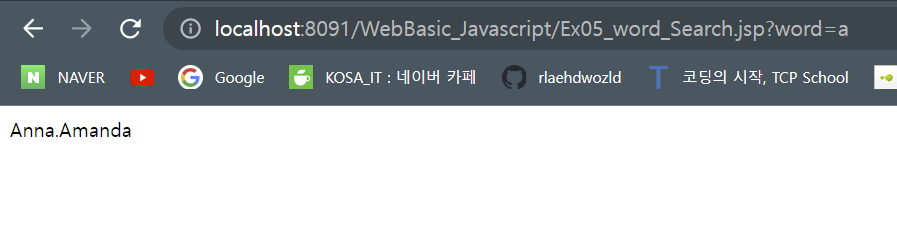
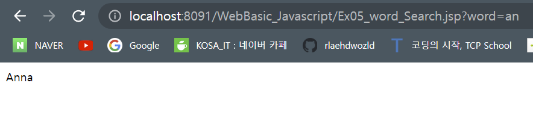
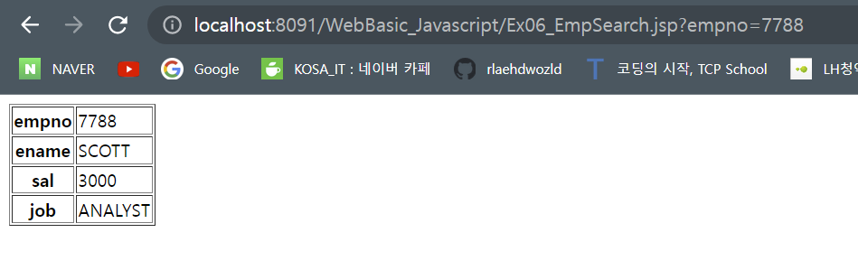

# 2022.10.28. 금요일

## 비동기

### 비동기 검색

- 검색시 대문자 소문자 상관없이, 짧은 단어로도 검색이 가능하도록 되게 하자!

word_Search.jsp

```jsp
<%@ page language="java" contentType="text/html; charset=UTF-8"
    pageEncoding="UTF-8"%>
<%
 String[] keyword = {
   "Anna"
  ,"Brittany"
  ,"Cinderella"
  ,"Diana"
  ,"Eva"
  ,"Fiona"
  ,"Gunda"
  ,"Hege"
  ,"Inga"
  ,"Johanna"
  ,"Kitty"
  ,"Linda"
  ,"Nina"
  ,"Ophelia"
  ,"Petunia"
  ,"Amanda"
  ,"Raquel"
  ,"Cindy"
  ,"Doris"
  ,"Eve"
  ,"Evita"
  ,"Sunniva"
  ,"Tove"
  ,"Unni"
  ,"Violet"
  ,"Liza"
  ,"Elizabeth"
  ,"Ellen"
  ,"Wenche"
  ,"Vicky" };

String q = request.getParameter("word");
String hint ="";

// lookup all hints from array if $q is different from ""
if (q != "") {
    q = q.toLowerCase();  //ABC >> abc
    int len = q.length(); //3
    for(String str : keyword){  //"Anna"
     //out.print(str.substring(0, len));
     if(str.substring(0, len).toLowerCase().equals(q)){
      if(hint ==""){
       //out.print("data : " + hint);
       hint = str;
      }else{
       hint += "." +str;
      }
     }
    }
}
%>
<%= hint == "" ? "no suggestion" : hint %>

```




비동기로 검색이 되도록 해보자

```html
<!DOCTYPE html>
<html>
  <head>
    <meta charset="UTF-8" />
    <title>Insert title here</title>
    <script type="text/javascript">
      let httpReq = null;
      function getInstance() {
        if (window.XMLHttpRequest) {
          httpReq = new XMLHttpRequest(); //현재 브라우져 XMLHttpRequest 내장
        } else if (window.ActiveXObject) {
          //IE6 이하   //지금 필요없어요
          httpReq = new ActiveXObject("Msxml2.XMLHTTP");
        } else {
          throw new Error("AJAX 지원하지 않습니다");
        }
        return httpReq;
      }

      function handlerStateChange() {
        if (httpReq.readyState == 4) {
          //1. 서버에서 응답이 왔다면
          if (httpReq.status >= 200 && httpReq.status < 300) {
            //개발자 마음 (가공)
            //서버가 비동기로 클라이언트 줄 수 있는  Data
            //1. Text (text, html , script , css , json)  >> responseText
            //2. xml                                      >> responseXML

            document.getElementById("word").innerHTML = httpReq.responseText;
          } else {
            alert("status Text : " + httpReq.status);
          }
        }
      }

      function sendData(word) {
        httpReq = getInstance();
        httpReq.onreadystatechange = handlerStateChange;
        httpReq.open("POST", "Ex05_word_Search.jsp?word=" + word);
        httpReq.send();
      }
    </script>
  </head>
  <body>
    <h3>단어 겁색하기</h3>
    word:<input type="text" id="txtword" onkeyup="sendData(this.value)" />
    <fieldset>
      <legend>검색단어</legend>
      <span id="word"> </span>
    </fieldset>
  </body>
</html>
```

## 실행 순서 완성해보기!

### DB연결해서 서버에서 파라매터를 이용해 받아오는 것을 비동기로 해보자!



### ajax를 통해 디비 연결하고 부트스트랩으로 비동기로 emp 테이블 정보 띄우기
