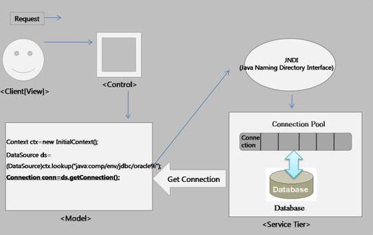
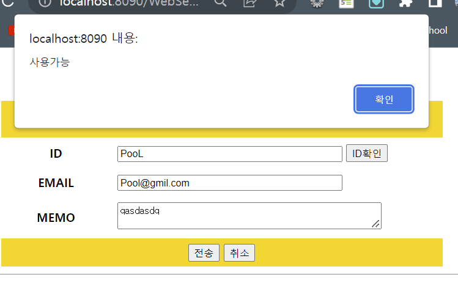
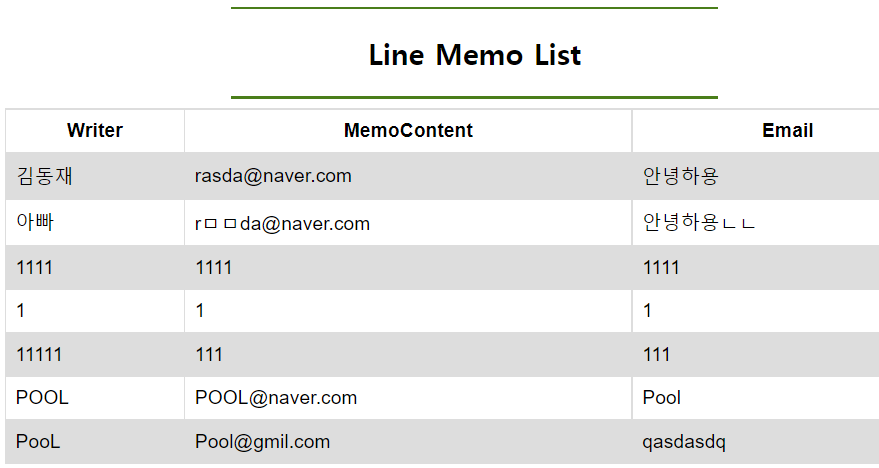
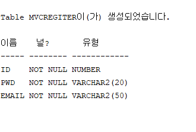
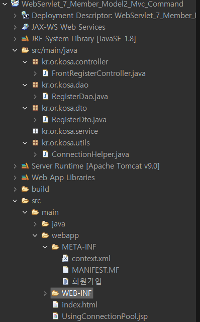
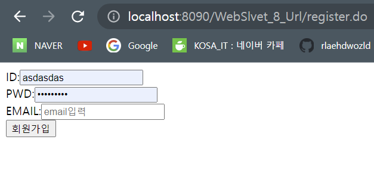
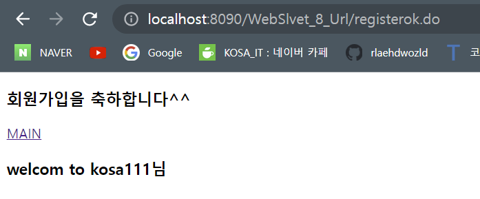
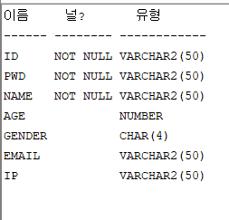

# 2022.10.31 월요일

## Servlet

### Connection Pool (Data Source를 이용해서 데이터베이스를 연결하기)

■ JNDI(Java Naming and Directory Interface) 란?  
JNDI의 정의를 보면 디렉터리 서비스에서 제공하는 데이터 및 객체를 발견하고 참고(lookup)하기 위한 자바 API라고 되어있다. 쉽게 말하면 외부에 있는 객체를 가져오기 위한 기술이다. Tomcat와 같은 WAS를 보면 특정 폴더에 필요한 데이터 소스(라이브러리)가 있는데 그것을 우리가 사용하기 위해 JNDI를 이용해서 가져오는 것이다.

1. DBCP(Database Connection Pool, 커넥션 풀) 란?  
   데이터베이스와 연결된 커넥션을 미리 만들어서 풀(pool) 속에 저장해 두고 있다가 필요할 때 커넥션을 풀에서 쓰고 다시 풀에 반환하는 기법을 말한다.웹 프로그램에서는 데이터베이스의 환경설정과 연결 관리 등을 따로 XML파일이나 속성 파일을 사용해서 관리하고, 이렇게 설정된 정보를 이름을 사용하여 획득하는 방법을 사용한다.- 웹 컨테이너가 실행되면서 커넥션(connection) 객체를 미리 풀(pool)에 생성해 둡니다.- DB와 연결된 커넥션(connection)을 미리 생성해서 풀(pool) 속에 저장해 두고 있다가 필요할 때에 가져다 쓰고 반환한다.- 미리 생성해두기 때문에 데이터베이스에 부하를 줄이고 유동적으로 연결을 관리 할 수 있다.


①. 사용자가 요청을 한다.

②. 요청은 Control을 거쳐 Molel로 전달된다.

③. Molel로 넘어간 요청은 JNDI에 등록된 데이터베이스 객체(Type:DataSource)를 검색한다.

④. JNDI를 통해 찾은 객체로부터 커넥션을 획득한다.

⑤. 데이터베이스 작업이 끝난 후 획득한 커넥션을 반납한다.

2. 커넥션풀(DBCP) 사용 이유  
   만약 한명의 접속자가 웹 사이트에 접속했다고 가정한다. 해당 웹 사이트에서 접속자는 게시판을 확인하고 자신이 쓴 게시물을 수정하고 또 새로운 게시글을 등록한다고 가정해보자.그럼 이 한명의 접속자로 인해 DB접속은 아래와 같이 발생한다.1) 데이터 취득2) 검색 후 데이터 취득3) 데이터 갱신4) 데이터 새등록즉 한명의 접속자로 인해 단 시간에 4번의 DB 접속이 일어난다.그럼 웹상에서 아주 짧은 시간에 몇번의 DB 접속이 일어날까? 만약 접속자가 1000명 이라면? <strong>즉 커넥션 풀이란 미리 커넥션 객체를 생성하고 해당 커넥션 객체를 관리하는것을 의미한다.</strong>즉 '커넥션 풀에 DB와 연결을 해 놓은 객체를 두고 필요할 때마다 커넥션 풀에서 빌려온다' 라고 이해하면 개념잡기에 쉬울듯 하다.그리고 연결이 끝나면 다시 풀에 돌려준다.커넥션 풀을 너무 크게 해놓으면 당연히 메모리 소모가 클것이고, 적게 해놓으면 커넥션이 많이 발생할 경우 대기시간이 발생할 것이다. 즉 웹 사이트 동시 접속자수 등 서버 부하에 따라 크기를 조정해야 할것이다.

3. 커넥션풀(DBCP)의 특징  
    - 풀 속에 미리 커넥션이 생성되어 있기 때문에 커넥션을 생성하는 데 드는 연결 시간이 소비되지 않는다. - 커넥션을 계속해서 재사용하기 때문에 생성되는 커넥션 수가 많지 않다.--> 커넥션 풀을 사용하면 커넥션을 생성하고 닫는 시간이 소모되지 않기 때문에 그만큼 어플리케이션의 실행 속도가 빨라지며, 또한 한 번에 생성될 수 있는 커넥션 수를 제어하기 때문에 동시 접속자 수가 몰려도 웹 어플리케이션이 쉽게 다운되지 않는다.

4. 그렇다면 동시 접속자 처리는..?  
   커넥션 풀에서 생성되어 있는 커넥션의 갯수는 한정적이다. 그렇다면 동시 접속자가 많아지면 어떻게 될까?커넥션 풀은 누군자 접속하면 커넥션 풀에 남아 있는 커넥션을 제공하는 식이다. 하지만 남아있는 커넥션이 없을 경우 해당 클라이언트는 대기 상태로 전환이 되고, 커넥션이 반환되면 대기하고 있는 순서대로 커넥션이 제공된다.
   출처 - https://devbox.tistory.com/entry/JSP-%EC%BB%A4%EB%84%A5%EC%85%98-%ED%92%80-1

### context.xml 설정

META-INF 밑에 context.xml파일 복사

하위 내용

Resource 커넥션풀을 만드는 기본 설정 (어떤DB , 계정을 가지고 접속 설정)  
<Strong>xml 설명 </Strong>  
<Resource  
auth="Container"  
driverClassName="oracle.jdbc.driver.OracleDriver"  
maxTotal="20" //커넥션 객체의 최대 갯수 (default 8)  
maxIdle="20" //사용하지 않는 idle(대기)상태의 최대 수  
maxActive="20" //DataSource로부터 꺼낼 수 있는 커넥션 최대 개수 기본값 : 8개  
name="jdbc/myoracle" // 사용자가 지정하는 임의의 이름  
type="javax.sql.DataSource"  
url="jdbc:oracle:thin:@127.0.0.1:1521:orcl" //원격접속의 경우 반드시 @로 설정한다.  
username="scott" //연결한 db 사용자 이름  
password="tiger" // 연결한 db의 비밀번호  
/>
password="1004"  
username="kosa"  
url="jdbc:oracle:thin:@192.168.0.218:1521:XE"  
name="jdbc/oracle" />

```xml
<?xml version="1.0" encoding="UTF-8"?>
<Context
	<Resource maxWait="-1"
			  maxIdle="20"
			  maxTotal="20"
			  maxActive="20"
			  password="1004"
			  username="kosa"
			  url="jdbc:oracle:thin:@localhost:1521:XE"
			  driverClassName="oracle.jdbc.OracleDriver"
              type="javax.sql.DataSource"
			  auth="Container"
              name="jdbc/oracle" />
</Context>
```

### Memo 프로젝트를 싱글톤에서 커낵션 풀로 바꿔보자

```html
<%@page import="javax.sql.DataSource"%> <%@page
import="javax.naming.InitialContext"%> <%@page import="javax.naming.Context"%>
<%@page import="java.sql.Connection"%> <%@ page language="java"
contentType="text/html; charset=UTF-8" pageEncoding="UTF-8"%>
<!DOCTYPE html>
<html>
  <head>
    <meta charset="UTF-8" />
    <title>Tomcat Connection Pool 사용하기</title>
  </head>
  <body>
    <% Connection conn = null; //JNDI Context context = new InitialContext();
    //현재 [프로젝트]에서 특정 이름을 가진 객체를 검색 (사용 : 이름기반 검색)
    DataSource ds = (DataSource)context.lookup("java:comp/env/jdbc/oracle"); //
    정해진 약속 : java:comp/env/ + jdbc/oracle //lookup 된 객체의 타입이
    DataSource //ds >> 튜브를 가지고 있는 가게의 주소 (...쉽게 ...) conn =
    ds.getConnection(); //튜브 주세요 out.print("db 연결여부 :" +
    conn.isClosed() + "<br />"); //반드시 집에 가실때 ... 튜부 반환 ....
    conn.close(); // POOL close() 반환하는 것 out.print("db 연결여부 :" +
    conn.isClosed() + "<br />"); //그래서 POOL 객체의 scope >> method 로 한정
    ....>> 사용하고 반환하자 ... %>
  </body>
</html>
```

MemoDao 수정

```java

package kr.or.kosa.dao;

import java.sql.Connection;
import java.sql.PreparedStatement;
import java.sql.ResultSet;
import java.sql.SQLException;
import java.util.ArrayList;
import java.util.List;

import javax.naming.Context;
import javax.naming.InitialContext;
import javax.sql.DataSource;

import kr.or.kosa.dto.Memo;
import kr.or.kosa.utils.SingletonHelper;

/*
DB연결
CRUD 함수 생성 > memo
1. 전체조회  : select id , email , content from memo
2. 조건조회  : select id , email , content from memo where id=? //제약 id >pk
3. 삽입     : insert into memo(id,email,content) values(?,?,?)
4. 수정     : update memo set email=? , content=? where id=?
5. 삭제     : delete from memo where id=?
알파... LIKE 검색  where email like '%naver%'


자바로 함수를 생성 .... 처리 ... 거의 똑같아요
ArrayList
HashMap
제너릭 ...

*/


public class MemoDao {
	/*
	싱글톤 방식 연습 (DB연결)
	Connection conn = null;

	public MemoDao() {
		conn = SingletonHelper.getConnection("oracle"); //singleton
	}
	*/

	//POOL
	DataSource ds = null;

	public MemoDao() {
		try {
			//JNDI
			Context context = new InitialContext();
			//현재 [프로젝트]에서 특정 이름을 가진 객체를 검색 (사용 : 이름기반 검색)
			ds = (DataSource)context.lookup("java:comp/env/jdbc/oracle"); //  정해진 약속 : java:comp/env/ + jdbc/oracle
		    //lookup 된 객체의 타입이 DataSource
		} catch (Exception e) {
			e.printStackTrace();
		}
	}


	//전체조회
	public List<Memo> getMemoList() throws SQLException{

		PreparedStatement pstmt = null;
		String sql="select id, email , content from memo";

		//////////////POOL//////////////////////
		Connection conn = ds.getConnection();
		//////////////////////////////////////


		pstmt = conn.prepareStatement(sql);
		ResultSet rs = pstmt.executeQuery();

		List<Memo> memolist = new ArrayList<Memo>(); //POINT
		//[new memo()][new memo()][new memo()][new memo()]
		while(rs.next()) {
			Memo m = new Memo();
			m.setId(rs.getString("id"));
			m.setEmail(rs.getString("email"));
			m.setContent(rs.getString("content"));

			memolist.add(m);
		}

		SingletonHelper.close(rs);
		SingletonHelper.close(pstmt);


		//Pool에게 연결 객체 반환
		conn.close();
		return memolist;
	}


	//조건조회 (where id=? : 데이터 1건 보장 : id컬럼 > unique , primary key)
	public Memo getMemoListById(String id) {

		//select id, email , content from memo where id=?
		//memo m = new memo();
		//return m

		return null;

	}


	//삽입
	//public int insertMemo(String id, String email , String content) parameter 객체 ...
	public int insertMemo(Memo m) {

		System.out.println(m.toString());
		int resultrow=0;

		PreparedStatement pstmt = null;
		String sql="insert into memo(id,email,content) values(?,?,?)";

		//Pool
		Connection conn= null;

		try {
			//Pool
			conn=ds.getConnection();// 지역변수라거 conn 객체 선언을 전역변수에서 해주고 연결을 try 안에서 해준다.

				pstmt = conn.prepareStatement(sql);

				pstmt.setString(1,m.getId());
				pstmt.setString(2,m.getEmail());
				pstmt.setString(3,m.getContent());

				resultrow = pstmt.executeUpdate();

		} catch (SQLException e) {
			// TODO Auto-generated catch block
			e.printStackTrace();
		}finally {
			SingletonHelper.close(pstmt);
			// Pool 반환
				try {
					conn.close();//반환하기
				} catch (Exception e2) {
					// TODO: handle exception
				}
		}


		return resultrow;
	}


	//수정
	public int updateMemo(Memo m) {
		return 0;
	}
	//삭제
	public int deleteMemo(String id) {
		return 0;
	}
	//검색
	public Memo idSearchByEmail(String email) {
		return null;
	}

	//ID 유무 함수
	public String isCheckById(String id) {

		String ismemoid=null;
		PreparedStatement pstmt = null;
		ResultSet rs = null;

		String sql="select id from memo where id=?";
		Connection conn = null;

		try {
			//Pool
			conn= ds.getConnection();
			  pstmt = conn.prepareStatement(sql);
			  pstmt.setString(1, id);

			  rs = pstmt.executeQuery();
			  if(rs.next()) {
				  //같은 ID 존재
				  ismemoid = "false";
			  }else {
				  //사용가능한 ID
				  ismemoid = "true";
			  }
		} catch (Exception e) {
			System.out.println(e.getMessage());
		}finally {
			SingletonHelper.close(rs);
			SingletonHelper.close(pstmt);
			try {
				//Pool 반환하기
			conn.close();
			} catch (Exception e2) {
				// TODO: handle exception
			}
		}

		return ismemoid;

	}
}
```

Memo.html 정상 실행 화면




### Connection 객체를 별도의 class로 관리하기 like Singleton

ConnectionHelper

```java
package kr.or.kosa.utils;

import java.sql.Connection;
import java.sql.DriverManager;
import java.sql.PreparedStatement;
import java.sql.ResultSet;
import java.sql.Statement;

import javax.naming.Context;
import javax.naming.InitialContext;
import javax.sql.DataSource;

public class ConnectionHelper {
	public static Connection getConnection(String dsn) {
		// Oracle, Mysql 두개를 사용한다는 전제하에
		if (dsn.toLowerCase().equals("oracle")) {
			try {
				Context context = new InitialContext();
				DataSource ds = (DataSource) context.lookup("java:comp/env/jdbc/oracle");
				Connection conn = ds.getConnection();
				return conn;

			} catch (Exception e) {
				System.out.println("connection: " + e.getMessage());
				return null;
			}

		} else if (dsn.toLowerCase().equals("mysql")) {
			try {
				Class.forName("com.mysql.cj.jdbc.Driver");
				Connection conn = DriverManager.getConnection(
						"jdbc:mysql://192.168.0.3:3306/sampledb?characterEncoding=UTF-8&serverTimezone=UTC&useSSL=true",
						"kosta", "1004");
				return conn;
			} catch (Exception e) {
				return null;
			}
		} else {
			return null;
		}
	}

	public static void close(Connection conn) {

		if (conn != null) {
			try {
				conn.close();
			} catch (Exception e) {
				System.out.println(e.getMessage());
			}
		}
	}

	public static void close(Statement stmt) {
		if (stmt != null) {
			try {
				stmt.close();
			} catch (Exception e) {
				System.out.println(e.getMessage());
			}
		}
	}

	public static void close(ResultSet rs) {
		if (rs != null) {
			try {
				rs.close();
			} catch (Exception e) {
				System.out.println(e.getMessage());
			}
		}
	}

	public static void close(PreparedStatement pstmt) {
		if (pstmt != null) {
			try {
				pstmt.close();
			} catch (Exception e) {
				System.out.println(e.getMessage());
			}
		}
	}
}
```

MemoDao
싱글톤을 헬퍼로 받아온다.  
연결

    	///POOL///////////////////////
    	Connection conn = ConnectionHelper.getConnection("oracle");
    	//////////////////////////////

<br>
close();

    	ConnectionHelper.close(rs);
    	ConnectionHelper.close(pstmt);

    	//POOL 에게 연결객체 반환////////////
    	ConnectionHelper.close(conn);

```java

package kr.or.kosa.dao;

import java.sql.Connection;
import java.sql.PreparedStatement;
import java.sql.ResultSet;
import java.sql.SQLException;
import java.util.ArrayList;
import java.util.List;

import kr.or.kosa.dto.Memo;
import kr.or.kosa.utils.ConnectionHelper;

/*
DB연결
CRUD 함수 생성 > memo
1. 전체조회  : select id , email , content from memo
2. 조건조회  : select id , email , content from memo where id=? //제약 id >pk
3. 삽입     : insert into memo(id,email,content) values(?,?,?)
4. 수정     : update memo set email=? , content=? where id=?
5. 삭제     : delete from memo where id=?
알파... LIKE 검색  where email like '%naver%'


자바로 함수를 생성 .... 처리 ... 거의 똑같아요
ArrayList
HashMap
제너릭 ...

*/
public class MemoDao {
	/*
	싱글톤 방식 연습 (DB연결)
	Connection conn = null;

	public MemoDao() {
		conn = SingletonHelper.getConnection("oracle"); //singleton
	}
	*/

	//POOL
	/*
	DataSource ds = null;

	public MemoDao() {
		try {
			//JNDI
			Context context = new InitialContext();
			//현재 [프로젝트]에서 특정 이름을 가진 객체를 검색 (사용 : 이름기반 검색)
			ds = (DataSource)context.lookup("java:comp/env/jdbc/oracle"); //  정해진 약속 : java:comp/env/ + jdbc/oracle
		    //lookup 된 객체의 타입이 DataSource
		} catch (Exception e) {
			e.printStackTrace();
		}
	}
	*/
	//전체조회
	public List<Memo> getMemoList() throws SQLException{

		PreparedStatement pstmt = null;
		String sql="select id, email , content from memo";

		///POOL///////////////////////
		Connection conn = ConnectionHelper.getConnection("oracle");
		//////////////////////////////

		pstmt = conn.prepareStatement(sql);
		ResultSet rs = pstmt.executeQuery();

		List<Memo> memolist = new ArrayList<Memo>(); //POINT
		//[new memo()][new memo()][new memo()][new memo()]
		while(rs.next()) {
			Memo m = new Memo();
			m.setId(rs.getString("id"));
			m.setEmail(rs.getString("email"));
			m.setContent(rs.getString("content"));

			memolist.add(m);
		}

		ConnectionHelper.close(rs);
		ConnectionHelper.close(pstmt);

		//POOL 에게 연결객체 반환////////////
		ConnectionHelper.close(conn);
		////////////////////////////////

		return memolist;
	}


	//조건조회 (where id=? : 데이터 1건 보장 : id컬럼 > unique , primary key)
	public Memo getMemoListById(String id) {

		//select id, email , content from memo where id=?
		//memo m = new memo();
		//return m

		return null;

	}


	//삽입
	//public int insertMemo(String id, String email , String content) parameter 객체 ...
	public int insertMemo(Memo m) {

		System.out.println(m.toString());
		int resultrow=0;

		PreparedStatement pstmt = null;
		String sql="insert into memo(id,email,content) values(?,?,?)";

		//POOL
		Connection conn = null;

		try {
				//POOL
				conn = ConnectionHelper.getConnection("oracle");

				pstmt = conn.prepareStatement(sql);

				pstmt.setString(1,m.getId());
				pstmt.setString(2,m.getEmail());
				pstmt.setString(3,m.getContent());

				resultrow = pstmt.executeUpdate();

		} catch (SQLException e) {
			// TODO Auto-generated catch block
			e.printStackTrace();
		}finally {
			ConnectionHelper.close(pstmt);
			try {
				ConnectionHelper.close(conn); //반환하기
			} catch (Exception e2) {
				// TODO: handle exception
			}
		}

		return resultrow;
	}

	//수정
	public int updateMemo(Memo m) {
		return 0;
	}
	//삭제
	public int deleteMemo(String id) {
		return 0;
	}
	//검색
	public Memo idSearchByEmail(String email) {
		return null;
	}
	//ID 유무 함수
	public String isCheckById(String id) {

		String ismemoid=null;
		PreparedStatement pstmt = null;
		ResultSet rs = null;

		String sql="select id from memo where id=?";

		Connection conn = null;
		try {
			  conn = ConnectionHelper.getConnection("oracle");
			  pstmt = conn.prepareStatement(sql);
			  pstmt.setString(1, id);

			  rs = pstmt.executeQuery();
			  if(rs.next()) {
				  //같은 ID 존재
				  ismemoid = "false";
			  }else {
				  //사용가능한 ID
				  ismemoid = "true";
			  }
		} catch (Exception e) {
			System.out.println(e.getMessage());
		}finally {
			ConnectionHelper.close(rs);
			ConnectionHelper.close(pstmt);
			try {
				ConnectionHelper.close(conn); //반환하기
			} catch (Exception e2) {
				// TODO: handle exception
			}
		}

		return ismemoid;

	}
}
```

### Model2 기반의 프로젝트 전체적인 연습해보기(cmd방식)

1. 회원테이블 생성하기

```sql
create table mvcregiter(
id number constraint pk_mvcregiter_id primary key,
pwd varchar2(20) not null,
email varchar2(50) not null

desc mvcregiter;
);
```



> > 웹 프로젝트 생성  
> > 연결 테이스 (DBCP) >> ojbc6.jar, context.xml, 연결.jsp>>Test END

Model2 mvc 패턴 작업

<Strong>Model</Strong>  
POJO(순수한 자바 코드)

1.  dto 생성하기>DB 가 가지고 있는 테이블과 같은 구조 클래스 생성>gettter, setter 구현
2.  DB연결 (Pool)> DAO> 최소한 CRUD함수 (전체조회, 조건조회, 삽입, 삭제, 수정+알파(LIKE))

Service 단... 나중에 한다.

<strong>View</strong>

1.  html or jsp 둘의 차이는 ( UI 데이터 출력 유무)>Boot>include> 모든 페이지> JSP
2.  EL & JSTL>Server에서 데이터를 담아서 (request) > forward> 그 request 객체...  
    ex) ${requestScope.list} or ${requestScope.id}>>출력(JSTL)
3.  JSP 보안적인 요소에 대해서 처리 > WEB-INF 폴더에 넣는다. >>views>member or admin or board > jsp관리
4.  ajax(비동기 처리)>xmlHttpRequest

<strong>Controller</strong>  
 방법!

1.  요청마다 Controller 생성하기( Servlet 생성)  
    1.1 write>/write > servletWrite  
    1.2 list>/list> servletList

2.요청마다 Controller 생성하지 말고 1개만 생성(Servlet 생성)  
 2.1 FrontController>> Servlet 1개만 만들고( 1개가 모든 요청 판단) > 판단의 근거는  
 2.1.1 판단의 근거

1. command 방식 : 글쓰기( Servlet.do?cmd=write), 글 목록 보기(servlet.do?cmd=list)  
   if(cmf.equals("write"){글쓰기 작업 수행}
2. url 방식 : 글쓰기(write.do?id=kglim&pwd=1004), 글목록보기(list.do)>> url 주소로 요청을 판단  
   주의) url 패턴>> \*.do

---

-package 구성  
-도메인 구성

kr.or.kosa.dto  
kr.or.kosa.dao  
kr.or.kosa.controller  
kr.or.kosa.utils



### Model2 기반의 프로젝트 전체적인 연습해보기(url방식)

Controller 변동 부분

```java

	String requestURI= request.getRequestURI();
	String contextPath = request.getContextPath();
	String urlcommand = requestURI.substring(contextPath.length());

	System.out.println("requestURI" +requestURI);
	System.out.println("contextPath" +contextPath);
	System.out.println("urlcommand" +urlcommand);

	if(urlcommand.equals("/register.do")) {
			//회원가입 페이지(VIEW)
			//VIEW만 전달
			viewpage="/WEB-INF/views/register/register.jsp";
		}else if(urlcommand.equals("/registerok.do")) {
			//회원가입 처리(DB작업)
			//입력 데이터 >> DB 연결>> insert >> 여부> 처리
			int id=Integer.parseInt(request.getParameter("id"));
			String pwd= request.getParameter("pwd");
			String email= request.getParameter("email");
      ...
```

register.jsp

```jsp
<form action="${pageContext.request.contextPath}/registerok.do" method="POST">
ID:<input type="text" name="id" placeholder="id입력" required="required"><br>
PWD:<input type="password" name="pwd" placeholder="pwd입력"required="required"><br>
EMAIL:<input type="text" name="email" placeholder="email입력"required="required"><br>
<input type="submit" value="회원가입">
</form>
```

index.html

```html
<body>
  <h3>회원 가입 하기</h3>
  <!--command 방식으로 처리  -->
  <!-- 	<a href="register.do?cmd=register">회원가입</a>
 -->
  <a href="register.do">회원가입</a>
  <a></a>
</body>
```





### 조별 과제

DB


교재 p666

다음날로 미뤄짐.
