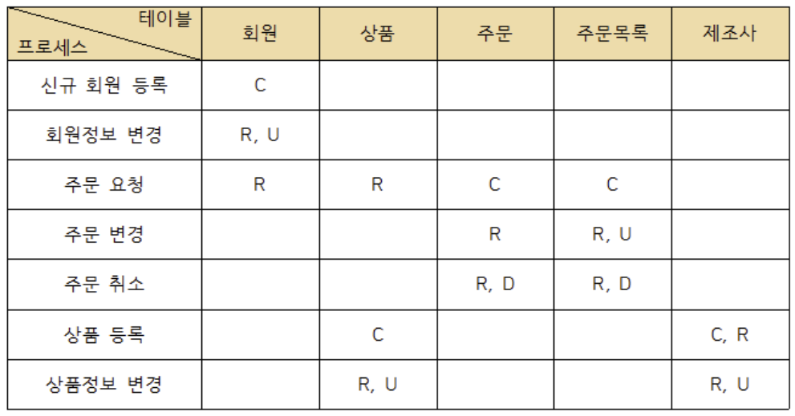
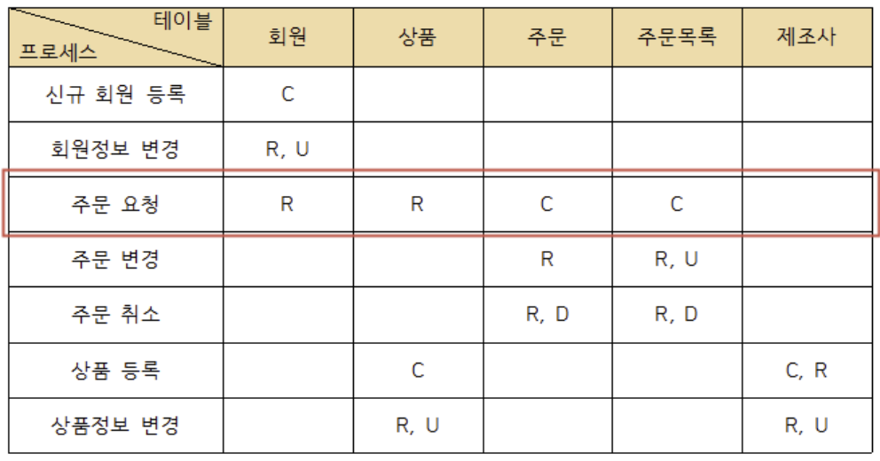
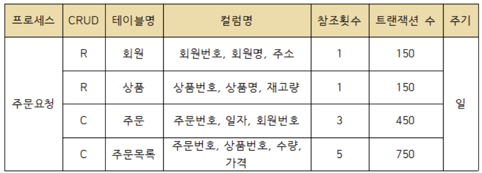

# 2022.11.01 화요일

## 조별과제

## 데이터 모델링

### 트랜잭션

-- 트랜잭션 정의

트랜잭션은 데이터베이스의 상태를 변환시키는 하나의 논리적 기능을 수행하기 위한 작업의 단위 또는 한꺼번에 모두 수행되어야 할 일련의 연산들을 의미한다.

- 트랜잭션은 데이터베이스 시스템에서 병행 제어 및 회복 작업 시 처리되는 작업의 논리적 단위로 사용
- 트랜잭션은 사용자가 시스템에 대한 서비스 요구 시 시스템이 응답하기 위한 상태 변환 과정의 작업 단위로 사용

트랜잭션 특성
다음은 데이터의 무결성을 보장하기 위하여 DBMS의 트랜젝션이 가져야 할 특성이다.

Atomicity(원자성)

트랜잭션의 연산은 데이터베이스에 모두 반영되도록 완료(Commit)되든지 아니면 전혀 반영되지 않도록 복구(Rollback)되어야 함

트랜잭션 내의 모든 명령은 반드시 완벽히 수행되어야 하며, 모두가 완벽히 수행되지 않고 어느 하나라도 오류가 발생하면 트랜잭션 전부가 취소되어야 함

Consistency(일관성)

트랜잭션이 그 실행을 성공적으로 완료하면 언제나 일관성 있는 데이터베이스 상태로 변환

시스템이 가지고 있는 고정 요소는 트랜잭션 수행 전과 트랜잭션 수행 완료 후의 상태가 같아야 함

Isolation(독립성, 격리성, 순차성)

둘 이상의 트랜잭션이 동시에 병행 실행되는 경우 어느 하나의 트랜잭션 실행 중에 다른 트랜잭션의 연산이 끼어들 수 없음

수행중인 트랜잭션은 완전히 완료될 때까지 다른 트랜잭션에서 수행 결과를 참조할 수 없음

Durability(영속성, 지속성)

성공적으로 완료된 트랜잭션의 결과는 시스템이 고장나더라도 영구적으로 반영되어야 함

CRUD 분석

CRUD는 '생성(Create), 읽기(Read), 갱신(Update), 삭제(Delete)'의 앞 글자만 모아 만든 용어이며, CRUD 분석은 데이터베이스 테이블에 변화를 주는 트랜잭션의 CRUD 연산에 대해 CRUD 매트릭스를 작성하여 분석하는 것이다.

- CRUD 분석으로 테이블에 발생되는 트랜잭션의 주기별 발생 횟수를 파악하고 연관된 테이블들을 분석하면 테이블에 저장되는 데이터의 양을 유추할 수 있음

- CRUD 분석을 통해 많은 트랜잭션이 몰리는 테이블을 파악할 수 있으므로 디스크 구성 시 유용한 자료로 활용할 수 있음

- CRUD 분석을 통해 외부 프로세스 트랜잭션의 부하가 집중되는 데이터베이스 채널을 파악하고 분산시킴으로써 연결 지연이나 타임아웃 오류를 방지할 수 있음

CRUD 매트릭스

CRUD 매트릭스는 2차원 형태의 표로서, 행에는 프로세스를, 열에는 테이블을, 행과 열이 만나는 위치에는 프로세스가 테이블에 발생시키는 변화를 표시하는 업무 프로세스와 데이터 간 상관 분석표이다.

CRUD 매트릭스를 통해 프로세스의 트랜잭션이 테이블에 수행하는 작업을 검증

CRUD 매트릭스의 각 셀에는 Create, Read, Update, Delete의 앞 글자가 들어가며, 복수의 변화를 줄 때는 기본적으로 C > D > U > R 의 우선순위를 적용하여 한가지만 적지만, 활용 목적에 따라 모두 기록할 수 있음

CRUD 매트릭스가 완성되었다면 C, R, U, D 중 어느 것도 적히지 않은 행이나 열, C나 R이 없는 행을 확인하여 불필요하거나 누락된 테이블 또는 프로세스를 찾음

트랜잭션 분석  
트랜잭션 분석의 목적은 CRUD 매트릭스를 기반으로 테이블에 발생하는 트랜잭션 양을 분석하여 테이블에 저장되는 데이터의 양을 유추하고 이를 근거로 DB 용량을 산정하고 DB 구조를 최적화하는 것이다.

트랜잭션 분석은 업무 개발 담당자가 수행

트랜잭션 분석을 통해 프로세스가 과도하게 접근하는 테이블을 확인하여 여러 디스크에 배치함으로써 디스크 입출력 분산을 통한 성능 향상을 가져올 수 있음

트랜잭션 분석서  
트랜잭션 분석서는 단위 프로세스와 CRUD 매트릭스를 이용하여 작성하며, 구성 요소에는 단위 프로세스, CRUD 연산, 테이블명, 컬럼명, 등이 있다.

단위 프로세스 : 업무를 발생시키는 가장 작은 단위의 프로세스

CRUD 연산 : 프로세스의 트랜잭션이나 데이터베이스 테이블에 영향을 주는 C, R, U, D의 4가지 연산

테이블명, 컬럼명 : 프로세스가 접근하는 데이터베이스의 테이블명을 기록. 필요한 경우 테이블의 컬럼명을 적음. 컬럼명을 적을 때는 마침표로 연결하여 '테이블.컬럼명'과 같이 적음

테이블 참조 횟수 : 프로세스가 테이블을 참조하는 횟수

트랜잭션 수 : 주기별로 수행되는 트랜잭션 횟수

발생 주기 : 연, 분기, 월, 일, 시간 등 트랜잭션 횟수를 측정하기 위한 발생 주기

출처: https://lipcoder.tistory.com/341 [기록공간:티스토리]

### 반정규화

[데이터 베이스 모델링 >> 성능적인 측면]

1. 정규화
2. 반정규화
3. 테이블 통합 ... 분할
4. 데이터 조인(JOIN)
5. PK , FK 설정

모델링 >> 성능  
정규화 (관심사별로 ...) : 주관심요소 별로 나누어서 관리 : 고객테이블 , 주문테이블

> AOP(관점 지향 프로그래밍)  
> 관심사 별로 분산

https://lipcoder.tistory.com/341  
CRUD 매트릭스 분석 (트랜잭션의 유형 파악)

C(insert) , R(select) , u (update) d(delete)

> > 용량과 트랜잭션의 유형 파악 >> 반정규화 (근거) => 무결성 문제 해결
> > 테이블 , 속성 , 관계 합치거나 나누거나 변경 .....

---

정규화

1. 데이터 중복 감소 >> 성능향상
2. 데이터 관심사로 관리 >> 성능 향성 (학생 , 성적)
3. 조인 질의 >> 성능저하
4. 학점 데이터 보고 싶은데 학생 이름 , 과목명 그리고 학과명 같이 보고 싶어요 (빈번하게 )
   > > 최소 3개 , 4개 조인 >> 성능저하

select 학점.평점, 과목.과목명 , 학생.학생명 , 학과.학과명  
from 학점 join 과목 on 학점.과목코드 = 과목.과목코드  
 join 학생 on 학점.학번 = 학생.학번  
 join 학과 on 학생.소속학과코드 = 학과.소속학과코드

정규화 모델 수행 >> 조회성능 >> 처리조건 >> 관심사별 테이블(성능 향상)  
 >> 나누어진 여러개의 정보 통합 ( 성능저하)

정규화 모델 수행 >> 입력, 수정, 삭제 작업 >> 성능향상

질의) 어떤 학생의 학년 변경  
정규화 전) 5000만건의 데이터 대상 어떤 학생 ... 학년 변경  
정규화 후) 1000만건에서 해당 학생의 학년만 한건 변경

질의) 4학년 학생의 학번 , 이름을 조회  
정규화 전) 5000만건 수강이력을 조회  
정규화 후) 1000만건 학생수 만큼 조회 (성능 향상)

질의) 학번 , 학생명 , 평점 조회시  
정규화 전) 하나의 테이블 조회  
정규화 후) 조인 (약간의 성능 저하)

반정규화(역정규화)  
<-> 비정규화

반(역정규화) > 정규화가 된 상황에서 (엔티티 , 속성 , 관계) 중복, 통합, 분리해서 성능향상 (조회)

비정규화(정규화 하지 않는 것)

과도한 반정규화 테이블 통합 >> 데이터 무결성 저하 (침해)

반정규화 절차 적인 방법

1. 대상 조사
2. 다른 방법 검토 (view, 파티셔닝 , 클러스트링(디스크 같은 블럭 저장) ,인덱스 추가(추가. 삭제. 변경)

create or replace view v100 > view 는 성능향상이 목적이 아니고 개발자의 편리성
as
select \* from .... (조인커리)

3. 반정규화 적용 방법
   3.1 테이블 반정규화
   3.2 속성 반정규화
   3.3 관계 반정규화

기법
[컬럼...반정규화]

1. 중복 컬럼 추가
2. 파생 컬럼 추가
3. 이력테이블컬럼 추가 ----이슈
4. PK분리 컬럼 추가
5. 테이터 복구를 위한 컬럼 추가 ---- 이슈

[테이블 반정규화]

1. 관계병합 (슈퍼 , 서브 타입) > 테이블 병합
2. 테이블 분할 > 수직 , 수평 분할
3. 테이블 추가 > 중복테이블추가 , 통계테이블추가 , 이력테이블추가 , 부분 테이블 추가

---
