# 2022.11.02 수요일

## Jquery

### jquery 예시

```html
<!DOCTYPE html>
<html>
  <head>
    <script src="https://ajax.googleapis.com/ajax/libs/jquery/3.6.0/jquery.min.js"></script>
    <script>
      $(document).ready(function () {
        $("p").click(function () {
          $(this).hide();
        });
      });
    </script>
  </head>
  <body>
    <p>If you click on me, I will disappear.</p>
    <p>Click me away!</p>
    <p>Click me too!</p>
  </body>
</html>
```

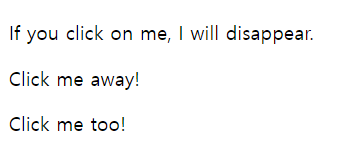
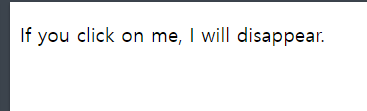

### 제이쿼리란?

jQuery는 경량의 "적게 작성하고 더 많이 수행하는" JavaScript 라이브러리입니다.

jQuery의 목적은 웹사이트에서 JavaScript를 훨씬 더 쉽게 사용할 수 있도록 하는 것입니다.

jQuery는 수행하는 데 많은 JavaScript 코드 행이 필요한 많은 일반적인 작업을 수행하고 코드 한 줄로 호출할 수 있는 메서드로 랩핑합니다.

또한 jQuery는 AJAX 호출 및 DOM 조작과 같은 JavaScript의 복잡한 많은 부분을 단순화합니다.

jQuery 라이브러리에는 다음 기능이 포함되어 있습니다.

- HTML/DOM 조작
- CSS 조작
- HTML 이벤트 메소드
- 효과 및 애니메이션
- ajax
- Utilities

### 제이쿼리 적용법

1. 다운로드  
   `<script type-"text/Javascript" src="script/jquery-3.6.1.min.js"></script>`
2. CDN(권장사항)  
   `< src="https://ajax.googleapis.com/ajax/libs/jquery/3.6.1/jquery.min.js"></script>`

### jquery 문법

The jQuery syntax is tailor-made for selecting HTML elements and performing some action on the element(s).

Basic syntax is: $(selector).action()

- A $ sign to define/access jQuery
- A (selector) to "query (or find)" HTML elements
- A jQuery action() to be performed on the element(s)

Examples:

$(this).hide() - hides the current element.

$("p").hide() - hides all <p> elements.

$(".test").hide() - hides all elements with class="test".

$("#test").hide() - hides the element with id="test".

### jQuery Selectors

제이쿼리 선택자는 css의 선택자가 선행학습이 필수적으로 되야한다.  
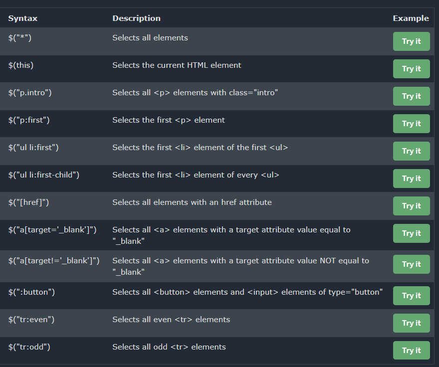

### Jquery 기초

1. jquery.com 공식사이트(버전 다운로드 , 학습(API))
2. https://www.w3schools.com/jquery/default.asp
3. Jquery
   -HTML/DOM manipulation (추가 , 변경 , 삭제)
   -CSS manipulation
   -HTML event methods
   -Effects and animations
   -AJAX (비동기 처리 ^^)
   -Utilities

4. Jquery(Javascript 라이브러리 (함수의 집합)) >> \*.js 배포
   4.1 jquery 사용방법 : js 파일만 배포 .....

- 다운로드 받아서 내 서버에서 배포 (소스 수정, 추가 )(281kb)
  Download the uncompressed, development jQuery 3.5.1

- 편집하지 않고 배포 (88kb)  
  Download the compressed, production jQuery 3.5.1
- CDN 방식(링크만 걸어서 외부사이트(글로벌) 배포 권장)
- 안정적인 다운로드 제공

​

5. jquery version (웹 브라우져 호환성 지원)  
   1.3.x ~ 3.5.x  
   1.x.x ~ 3.x.x

3.x : 현재 사용 (기존 필요없는 것은 제거 , 새로운 것은 추가)  
-회사 (1.x 버전 개발 ....... >> 사장님 3.x)  
-문제는 기존 소스가 1.x 버전에 있는 함수(add() ) ->> 3.x \*(add() 삭제 addOn() )

- 코드 add() . add() >> 3.x >> 해결 >> 소스에 있는 add() >> addOn()
- migrate : 하위 버전 호완성 (사라진 자원) >> add()
  Download the compressed, production jQuery Migrate 1.4.1

### ex03

```jquery
    $(document).ready(function(){ //모든 요소가 메모리에 DOM 객체 형태로 로딩되고 난 후..!
        //선택자
        //https://api.jquery.com/ 사이트에서 API 검색하고 찾아서 사용
        $('body > *').css("color", "gold"); //자식 선택자
     $('div > *').css('color','red'); //div 자식 요소
     $('input[type=text]').css("color", "green"); //속성 선택자
     /*
     DOM script : text, value (innerHtml,innerText)

     jQuery
     3개함수 (val(), text(), html()) > 값을 read, write > getter, setter
     ex) val('홍길동') > write(setter)
     ex) val() > read(getter)

     jQuery id 활용
     <input type="text" id="userid" value="aaa">
     >> $('#userid').val() >> aaa 값을 받을 수 있다

     <input type="text" id="userid" value="aaa">
     >> $('#userid').val("bbb") >> id="userid" value="bbb">

     DOM > document.getElementById("userid") value="id">

     */

     //***** read 처음 만나는 요소
     console.log($('input[type=text]').val());

     //***** write 모든 요소 적용 가능
     $('input[type=text]').val("hong");

     $('input[type=password]').val("11111"); //모든 요소에 적용

     $('tr:odd').css("background", "gray"); //1,3,5 //tr:odd - >
     $('tr:even').css("background", "pink"); //0,2,4

     //jquery하고javascript 같이 사용
     //당근
     setTimeout(function(){
      let value= $('select>option:selected').val();
      alert("select tag value"+value);
     },3000)

    });
```

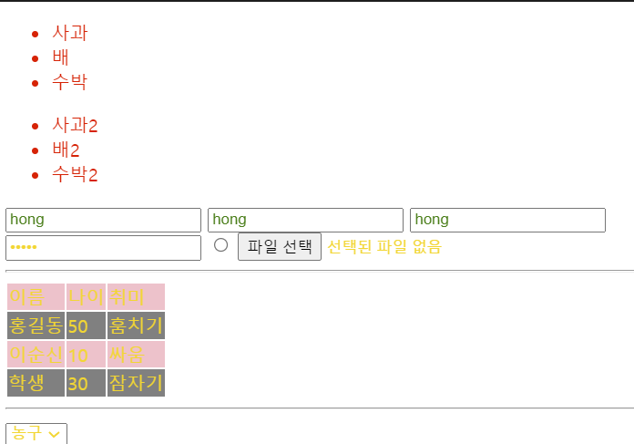
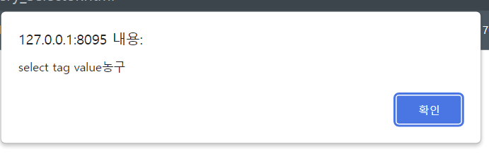

### ex04

```jquery하고javascript
<script>
    $(function () {
      $('#btncopy').click(function(){
       // let data= $('#txtuserid').val();
        // $('#txtcopyuserid').val(data);
        $('#txtcopyuserid').val($('#txtuserid').val());
      });
      //select 태그
      $('#select_hobby').change(function(){//값의 변화가 일어나면
        const text=$(':selected').text();
        console.log(text);

        const text2=$('#select_hobby option:selected').text();
        console.log(text2);

        const val=$('#select_hobby').val();//value 없는 경우text value 값으로...
        console.log(val);
      });

      $('#txtpwd2').keyup(function(){
        if($('#txtpwd').val() !=$('#txtpwd2').val()){
          //div p태그 : innerText, innerHTML

          $('#message').text("<h3>암호가 일치하지 않아요</h3>")
        }else{
          $('#message').text("<h3>암호가 일치합니다.</h3>")

        }
      });
      //body 안에 있는 모든 input태그 focus가 오면 input 태그 background-color gray
      //body 안에 있는 모든 input태그 blur가 오면 input 태그 background-color gray
      $('input').focus(function(){
        console.log(this)//$(this).action()
        $(this).css('background-color','gray');
      });

      $('input').blur(function(){
        console.log(this)//$(this).action()
        $(this).css('background-color','white');
      });

      //toggle(on, off)이벤트
      //.hover(function(){},function(){})
      $('p').hover(function(){
        $(this).css('background-color','gold');
    },function(){
      $(this).css('background-color','red');
    }
      );

    });

  </script>
```

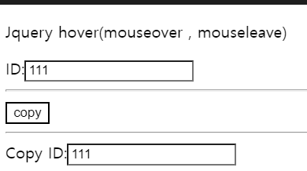
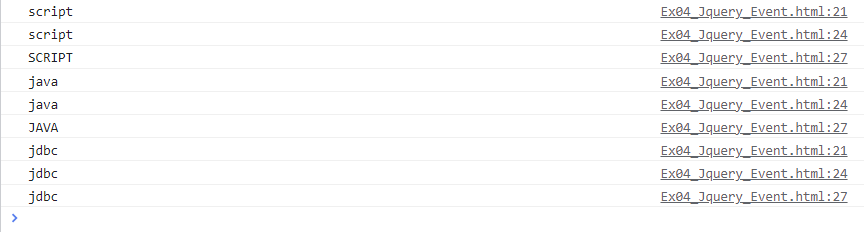
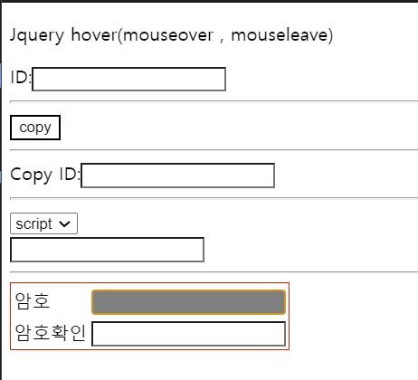
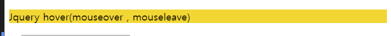
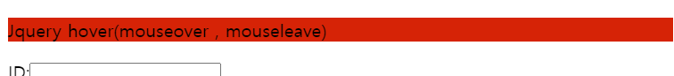

### ex05

```jquery
    $(function(){
      $('p').on(
        {
          mouseleave:function(){$(this).css('background-color','red')},
          click:function(){$(this).css('background-color','green')},
          mouseenter:function(){$(this).css('background-color','blue')}
        }
      );
      $('button').click(function(){
        $('p').off('click');//제거
      });
    });
```

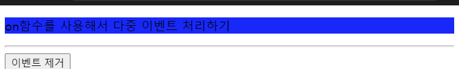
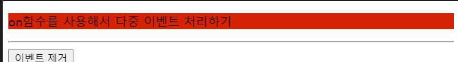
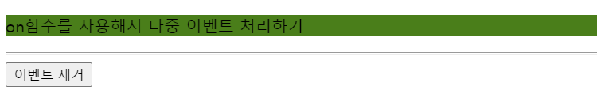
이벤트 제거 버튼 누르면 click이벤트 사라짐

### ex06

```jquery
$(function(){
			$('td:contains("홍길동")').addClass('redcolor');	//홍길동이라는 글자가 포함되어 있는 td태그를 찾아라
			$('td:contains("홍길동")').siblings().addClass('bluecolor')
			.parent().find("td:eq(0)") //td태그 0번쨰 태그 찾아라(필터 함수)
			.addClass("greencolor");


			$('#btnclick').on('click',function(){
				alert("click");
			});
      //parameter JSON 객체
      // $('#btnclick').on(
      //   {
      //     click:function(){alert("click");}
      //   }
      // )

			$('#btnclick').on('mouseover',function(){
				document.getElementById("btnclick").style.backgroundColor="red";
			});

			$('#btnclick').on('mouseout',function(){
				document.getElementById("btnclick").style.backgroundColor="white";
			});

			$('#btnclick2').on('click',function(){
				$('#btnclick').off('click');
			});

			//jquery 좋아하는 코드 parameter 객체(json)
			$('#stylediv').on(
				{
					mouseover:function(){ $('#stylediv').addClass('greencolor');  },
					mouseout:function(){
						$('#stylediv').removeClass('greencolor');
						$('#stylediv').addClass('bluecolor');
					}
				}
			)

		});
```

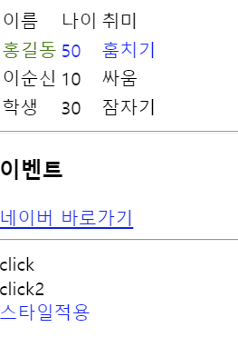

### ex08

콘솔로 출력해보기
//btnok 클릭하면
//isF2 태그에 선택된 요소의 값을 모두 출력하세요(hint: array)
//let data=$('#isF2').val();

```jquery
    $('#btnok').click(function(){
        const data=$('#isF2').val();
        console.log(data);
        for(let index in data){
          console.log("value :"+data[index]);
        }
      });
    });
```

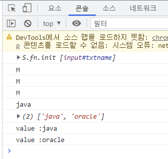

//id가 myform인 것 중의 자손중에 input태그안에 submit있는 요소

### 09

[javascript] 1. for(let index in Arrays){Array[index]} 2. Object(JSON) : for(let key in jsonObj){jsonobj[key]} 3. array.forEach(function(value,index,array){} ) 추가) array.map()...

    [jquery]
    $().each() 반복문
    1.$(selector).each(function(){});  >>   ex) $('p').each(function(){this 활용});
    2.$(selector).each(function(index){thi활용});
    3.$(selector).each(function(index, element){element});  // 얘를 쓰면 제일 편하다.

    [jquery] $.each()
    1. $.each(Array or Object, function(){this 활용});
    2. $.each(Array or Object, function(index){this 활용});
    3. $.each(Array or Object, function(index,element){element});

    parameter JSON 객체라면
    let obj= {name:"홍길동",age:100};
    $(obj).each(function(key,value){value});
    $.each(obj, function(key,value){value});

```jquery
  $(document).ready(function(){
    $('p').each(function(){
      //callback함수 4번 호출된다.
      //this > p태그
      //$(this)선택자 this 사용해서jquery 다양한 함수를 적용가능
      console.log("this:"+$(this).text());

    });
        });
```

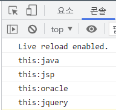

```jquery
    $('p').each(function(index){
      //callback함수 4번 호출된다.
      //this > p태그
      //$(this)선택자 this 사용해서jquery 다양한 함수를 적용가능
      console.log("index:"+index);
      console.log(this);

      //index 활용하기
      $(this).attr("id","param-"+index);
      $(this).attr("style","color:red");

    });
  });
```

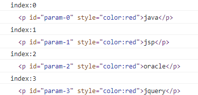
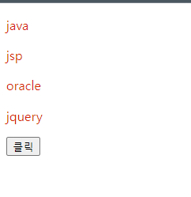

```jquery
    $('p').each(function(index,element){//초급자 입장에서는 이게 편하다.
      console.log("index:"+index);
      console.log(element);
      console.log("elemnet :"+$(element).text());
    })
```

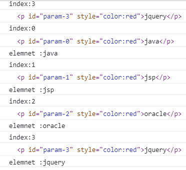

```jquery
    $('#btn').click(function(){
      alert($('#param-1'.text()));
    });
```

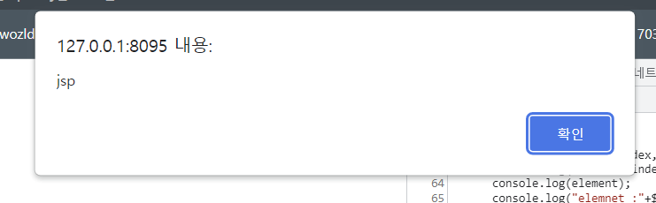

    let arr=[];
    arr.push("A");

    let arr=["사과","배","딸기"];

    let obj={};

    //json 객체 배열을 만들어라
    let obj={};
    let arrobj=[{},{},{}];
    ```jquery

        let array=[
    {"name":"naver","link":"www.naver.com"},
    {"name":"daum","link":"www.daum.net"},
    {"name":"kosa","link":"www.kosa.com"},
    ];

    //객체 배열.....
    //문제1)
    //$.each()를 사용해서 name 속성의 value값, link 속성의 value 값 출력
    $.each(array,function(index,obj){
      console.log(obj);//point!!!!  객체.속성명 or 객체["속성명"]
      console.log(obj.name+"/"+obj["link"]);
    });
    ```

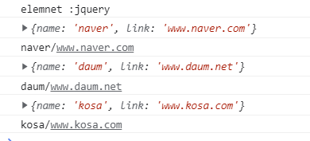

let boardobj = {
values:[
{no:1, title:"hello world"},
{no:2, title:"korea"},
{no:3, title:"kosa world"}
],
search:"검색"
};

//1. $.each()사용해셔 no 값과 title 값을 출력하세요

        $.each(boardobj.values, function(index, obj){
                console.log(index + " / " + obj.no + "," + obj["title"]);
            });

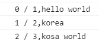

//2. $.each(boardobj)>key 와 value 값을 출력하세요

            $.each(boardobj, function(key, value){
                console.log(key + " / " + value);
            });

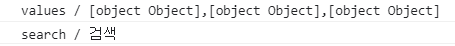

//3. $.each no 값, search 값을 출력하세요(KEY POINT!!!!!!!)

```jquery
       $.each(boardobj,function(key , value){
       if(typeof(value) == "object"){
       //[{},{},{}]
       $.each(value,function(index,obj){
       console.log(index + " / " + obj.no + " ..." + obj["title"]);
       });
       }else{
       console.log(key + " / " + value);
       }
       });
```

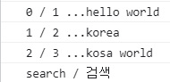

### ex10

너구리 슬라이드를 제이쿼리로 바꾸자

```jquery
   <script type="text/javascript">
   	$(document).ready(function(){
   		let mediaList=[];

   		$.each(data.items, function(index, element){
   			mediaList.push(element.media.m);
   		});

   		let index = 0;

   		/*img 클래스에 src 속성을 추가하고 value 값을 mediaList[0] 값으로 >   첫번째 사진*/
   		$('#imgs').attr('src', mediaList[0]);

   		/*prv 클래스에 click 이벤트를 걸어 index가 0일땐 다시 맨 마지막 사진이 나오도록 함*/
   		$('#prv').click(function(){
   			if(index==0){
   				index = mediaList.length;
   			}

   			$('#imgs').attr('src', mediaList[--index]);
   			console.log("index : " + index);
   		});

   		$('#next').click(function(){
   			if(index == (mediaList.length-1)) {
   				index = -1;
   			}

   			$('#imgs').attr('src', mediaList[++index]);
   			console.log("index : " + index);
   		});
   	});

   </script>
```

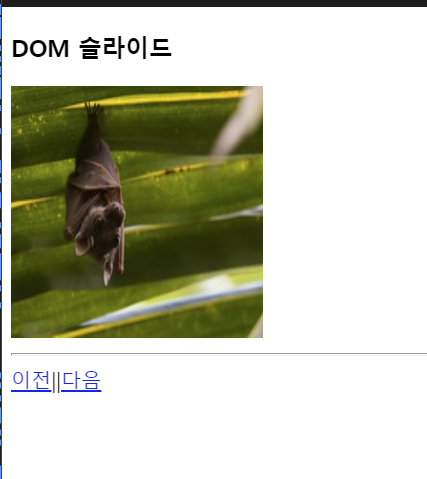
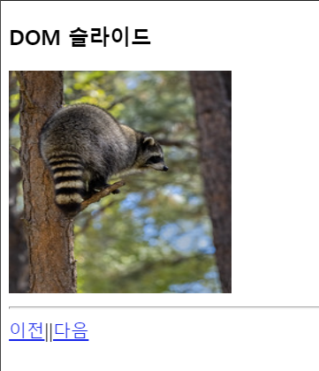

### ex11

- append() - Inserts content at the end of the selected elements
- prepend() - Inserts content at the beginning of the selected elements
- after() - Inserts content after the selected elements
- before() - Inserts content before the selected elements

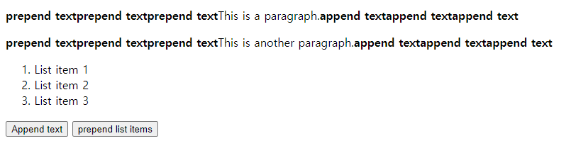

### ex12

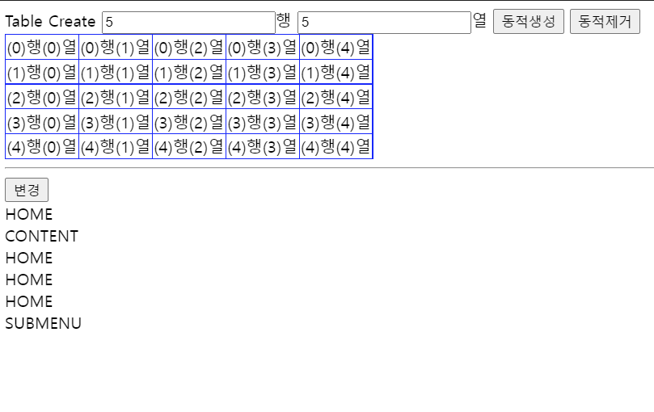

```jquery
$('#btnmenu').click(function(){
				//method chain : 함수().함수().함수
				//chain 지원하지 않아요  함수(함수(함수()))
				//$('#menu').clone().appendTo("#submenu");  //appendTo(target)
				$('#menu').clone().prependTo("#submenu");
			});
```

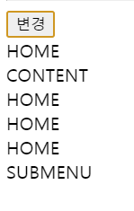

```jquery
			$('#btnmenu').click(function(){
				//method chain : 함수().함수().함수
				//chain 지원하지 않아요  함수(함수(함수()))
				$('#menu').clone().appendTo("#submenu");  //appendTo(target)
				//$('#menu').clone().prependTo("#submenu");
			});
```

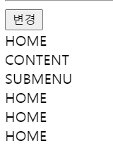

### ex13

```jquery
  const arrayobj=[];


  /*
  101 th 홍길동 10
  102 th 김유신 20
  103 th 유관순 30

  객체배열
  [{},{},{}]
  ex){th:101th, name:홍길동 , age:10} 형식 객체
  arrayobj.push({});
  */
 $('table>tbody>tr').each(function(index,element){
//   console.log(element);
//   console.log($(element).children().eq(0).text());
    arrayobj.push(
      {
        th :$(element).children().eq(0).text(),
        name :$(element).children().eq(1).text(),
        age :$(element).children().eq(2).text()
      }
    );
```

console.log(arrayobj);
//2. 결과 배열을 순수한 자바스크릡트 for문을 써서(일반 for문)
// 그 결과를 append시키자.
let output="";
for(let i ; i<arrayobj.length;i++){
output+=arrayobj[i].th+","+
arrayobj[i].name+","+
arrayobj[i].age;
}

    //3. 결과 배열을 순수한 자바스크릡트 개선된 for문을 써서 (console.log())
    for(const index in arrayobj){
      console.log(arrayobj[index].th);
      console.log(arrayobj[index].name);
      console.log(arrayobj[index].age);

}

    //4. jquery each문을 통해서 출력()
    //그 결과를 display2에 append 하세요
    $.each(arrayobj,function(index,obj){
      $('#display2').append(obj.th+","+obj.name+","+obj.age)
    })

});
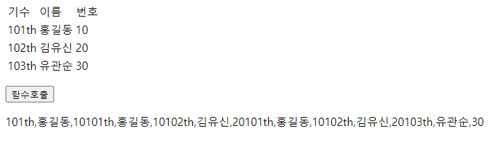
