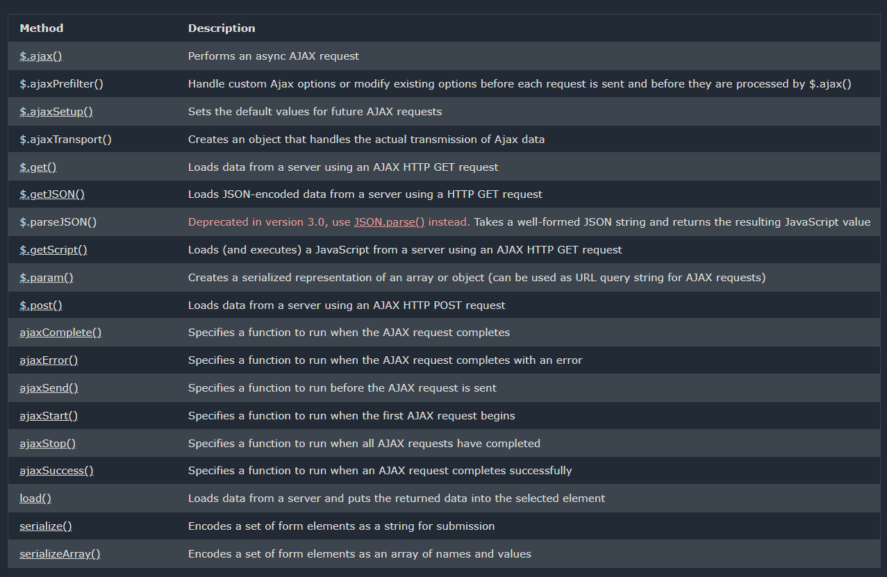
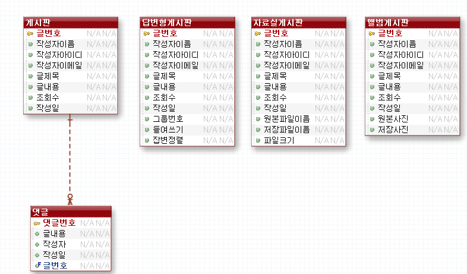
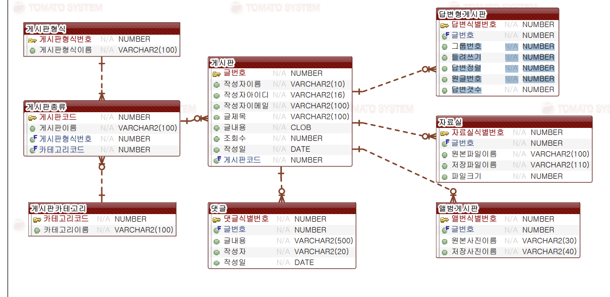

# 2022.11.07 화요일

## Jquery

### 비동기 함수

https://www.w3schools.com/jquery/jquery_ref_ajax.asp

### ex09

### ex10

### ex11

### ex12

### CORS

https://inpa.tistory.com/entry/WEB-%F0%9F%93%9A-CORS-%F0%9F%92%AF-%EC%A0%95%EB%A6%AC-%ED%95%B4%EA%B2%B0-%EB%B0%A9%EB%B2%95-%F0%9F%91%8F#2._%EC%84%9C%EB%B2%84%EC%97%90%EC%84%9C_Access-Control-Allow-Origin_%EC%84%B8%ED%8C%85%ED%95%98%EA%B8%B0

### ex13

### postman

### 조별과제 완성

### 게시판

### 게시판 db 차이

1. 검색하기 쉬울 것 같다. (조인의 차이)
2. 유지보수가 어렵다.(중복데이터가 많기때문에)(무결성)
3. 기능을 추가할 때 각각해줘야 하는 부담
4. 1대n 관계를 갖는 대용량 데이터베이스 처리에 약하다.
5. 정규화 따른 갱신 비용이 많이 든다.
6. 빅데이터 처리시 비 효율적
7. 데이터베이스 부하를 분석하기 쉽다.
   
